# Plugin map

> Generated by `scripts/build-plugin-graph.mjs`. Do not hand-edit.

Skills: **39** · Agents: **8** · Rules: **8** · Phases: **4** · Hook events: **5** (11 commands)

```mermaid
flowchart TB
  subgraph phases[WORKFLOW phases]
    dev_brainstorm["dev-brainstorm"]
    system_design["system-design"]
    dev_plan["dev-plan"]
    dev_execute["dev-execute"]
  end
  subgraph skills[Skills suggested]
    s_dev_brainstorm["dev-brainstorm"]
    s_dev_research["dev-research"]
    s_dev_audit["dev-audit"]
    s_vibe_rules["vibe-rules"]
    s_doc_update_project["doc-update-project"]
    s_design_system["design-system"]
    s_design_database["design-database"]
    s_design_frontend["design-frontend"]
    s_dev_plan["dev-plan"]
    s_dev_parallel["dev-parallel"]
    s_dev_execute["dev-execute"]
    s_dev_tdd["dev-tdd"]
    s_dev_debug["dev-debug"]
    s_dev_verify["dev-verify"]
    s_review_code["review-code"]
    s_review_simplify["review-simplify"]
    s_dev_refactor["dev-refactor"]
    s_review_security["review-security"]
    s_review_performance["review-performance"]
    s_doc_update_agent["doc-update-agent"]
    s_dev_commit["dev-commit"]
  end
  dev_brainstorm --> s_dev_brainstorm
  dev_brainstorm --> s_dev_research
  dev_brainstorm --> s_dev_audit
  dev_brainstorm --> s_vibe_rules
  system_design --> s_doc_update_project
  system_design --> s_design_system
  system_design --> s_design_database
  system_design --> s_design_frontend
  dev_plan --> s_dev_plan
  dev_plan --> s_dev_audit
  dev_plan --> s_dev_parallel
  dev_plan --> s_vibe_rules
  dev_execute --> s_vibe_rules
  dev_execute --> s_dev_execute
  dev_execute --> s_dev_tdd
  dev_execute --> s_dev_debug
  dev_execute --> s_dev_verify
  dev_execute --> s_dev_parallel
  dev_execute --> s_review_code
  dev_execute --> s_review_simplify
  dev_execute --> s_dev_refactor
  dev_execute --> s_review_security
  dev_execute --> s_review_performance
  dev_execute --> s_doc_update_project
  dev_execute --> s_doc_update_agent
  dev_execute --> s_dev_commit
```

## Counts

| Kind | Count |
|------|------:|
| skills | 39 |
| agents | 8 |
| rules | 8 |
| phases | 4 |
| hook_events | 5 |
| hook_commands | 11 |
| edges | 26 |
