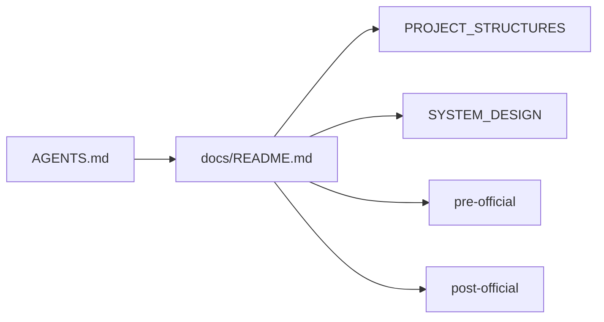

# luna-marketplace — docs index

> **Role:** project doc catalog · **Entry:** [`AGENTS.md`](../AGENTS.md) (`CLAUDE.md` → symlink)

## Doc map

## Catalog

<!-- luna:generated:catalog:start -->
| File | Role | Lifecycle | Agent keywords |
|------|------|-----------|----------------|
| [`AGENTS.md`](../AGENTS.md) | **reference** — AGENTS | official | — |
| [`decisions/2026-07-18-fleet-rules-canonical.md`](decisions/2026-07-18-fleet-rules-canonical.md) | **decision** — Fleet rules — plugin rules/ is canonical across registered projects | official | rules, sync-agent-views, fleet, centralization |
| [`decisions/2026-07-18-studio-host-first.md`](decisions/2026-07-18-studio-host-first.md) | **decision** — Luna Studio is host-first (no multi-project Docker) | official | studio, docker, host-first, registry |
| [`decisions/README.md`](decisions/README.md) | **decision** — README | official | — |
| [`examples/README.md`](examples/README.md) | **reference** — README | official | — |
| [`PLANS.md`](PLANS.md) | **plan** — PLANS | official | — |
| [`plans/2026-06-14-luna-agent-kit-v2.md`](plans/2026-06-14-luna-agent-kit-v2.md) | **plan** — Luna Agent Kit — v2 build plan (phases 1–4) | official | luna-agent-kit, v2 |
| [`plans/2026-06-15-phase-1-review-fixes.md`](plans/2026-06-15-phase-1-review-fixes.md) | **plan** — Phase 1 review fixes | official | review, fixes |
| [`plans/2026-07-18-luna-studio.md`](plans/2026-07-18-luna-studio.md) | **plan** — Luna Studio — control plane for plugin knowledge | official | studio, knowledge, control-plane |
| [`plans/2026-07-18-sharks-loop.md`](plans/2026-07-18-sharks-loop.md) | **plan** — Sharks-Loop — plugin half | official | sharks-loop |
| [`plans/IMPLEMENTATION_PLANS.md`](plans/IMPLEMENTATION_PLANS.md) | **plan** — IMPLEMENTATION PLANS | official | — |
| [`post-official/completed-plans/2026-07-18-doc-lifecycle-restructure.md`](post-official/completed-plans/2026-07-18-doc-lifecycle-restructure.md) | **plan** — Doc lifecycle restructure (PRE/OFFICIAL/POST) | post_official | lifecycle |
| [`post-official/completed-plans/README.md`](post-official/completed-plans/README.md) | **reference** — README | post_official | — |
| [`post-official/legacy/README.md`](post-official/legacy/README.md) | **reference** — README | post_official | — |
| [`post-official/README.md`](post-official/README.md) | **reference** — README | post_official | — |
| [`pre-official/audits/README.md`](pre-official/audits/README.md) | **spec** — README | pre_official | — |
| [`pre-official/README.md`](pre-official/README.md) | **reference** — README | pre_official | — |
| [`pre-official/research/README.md`](pre-official/research/README.md) | **spec** — README | pre_official | — |
| [`PROJECT_STRUCTURES.md`](PROJECT_STRUCTURES.md) | **architecture** — Luna Agent Kit — Project Structure | official | structure, layout, skills, hooks |
| [`README.md`](README.md) | **reference** — README | official | — |
| [`specs/2026-07-18-doc-lifecycle-pre-official-post.md`](specs/2026-07-18-doc-lifecycle-pre-official-post.md) | **spec** — Doc lifecycle — PRE_OFFICIAL / OFFICIAL / POST_OFFICIAL | official | lifecycle, docs, pre_official, post_official |
| [`specs/2026-07-18-sharks-loop-convergence-oracle.md`](specs/2026-07-18-sharks-loop-convergence-oracle.md) | **spec** — Sharks-Loop — convergence oracle for the coding-agent loop | official | sharks-loop, verification, convergence |
| [`specs/2026-07-18-studio-server-actions-contract.md`](specs/2026-07-18-studio-server-actions-contract.md) | **spec** — Studio Server Actions — vault CRUD + sync boundary | official | studio, server-actions, vault, sync, authorization |
| [`specs/2026-07-18-sync-agent-views-contract.md`](specs/2026-07-18-sync-agent-views-contract.md) | **spec** — sync-agent-views — generation / no-clobber contract | official | sync-agent-views, generated, memory, rules, clobber |
| [`specs/2026-07-18-vault-crud-contract.md`](specs/2026-07-18-vault-crud-contract.md) | **spec** — Studio vault CRUD — mutation / safety contract | official | studio, crud, vault, git, path-confinement, authorization |
| [`specs/2026-07-19-fleet-sync-contract.md`](specs/2026-07-19-fleet-sync-contract.md) | **spec** — Fleet sync — plugin rules/ → all registry projects | official | fleet, sync-agent-views, rules, registry, T5 |
| [`specs/code-intelligence-tools-comparison.md`](specs/code-intelligence-tools-comparison.md) | **spec** — GitNexus vs codebase-memory-mcp vs CodeGraph | official | gitnexus, jscpd, code-intelligence |
| [`specs/monorepo-refactor-playbook.md`](specs/monorepo-refactor-playbook.md) | **spec** — Monorepo + submodule refactor playbook | official | monorepo, submodule, refactor, jscpd |
| [`specs/vibe-rules-dedup-handoff.md`](specs/vibe-rules-dedup-handoff.md) | **spec** — vibe-rules dedup + ECC retirement — handoff | official | vibe-rules, ecc, handoff |
| [`SYSTEM_DESIGN.md`](SYSTEM_DESIGN.md) | **architecture** — Luna Agent Kit — System Design | official | architecture, plugin, workflow, gitnexus |
| [`TODO.md`](TODO.md) | **reference** — TODO | official | — |
| [`TOOLS_LIST.md`](TOOLS_LIST.md) | **reference** — TOOLS LIST | official | — |
| [`VIBE_RULES.md`](VIBE_RULES.md) | **reference** — VIBE RULES | official | — |
| [`workflows/WORKFLOW.md`](workflows/WORKFLOW.md) | **reference** — WORKFLOW | official | — |
<!-- luna:generated:catalog:end -->

## Ownership rules (no duplication)

| Topic | Canonical doc | Never duplicate in |
|-------|---------------|-------------------|
| Directory layout & paths | `PROJECT_STRUCTURES.md` | `SYSTEM_DESIGN.md` |
| Service architecture | `SYSTEM_DESIGN.md` | `PROJECT_STRUCTURES.md` |
| Doc lifecycle stages | `AGENTS.md` / this catalog | scattered READMEs |
| Commands & env vars | `AGENTS.md` | any `docs/*.md` |

## Read order

1. [`PROJECT_STRUCTURES.md`](PROJECT_STRUCTURES.md) — where code lives
2. [`SYSTEM_DESIGN.md`](SYSTEM_DESIGN.md) — architecture overview
3. Task-specific doc (lifecycle → `pre-official/` / `post-official/`; API → `docs/api/`)
4. GitNexus for callers/callees/impact — never grep for call graphs

## Lifecycle folders

- **`pre-official/`** — concept / research / audits (not yet current truth)
- **`specs/`**, **`plans/`**, root architecture docs — OFFICIAL
- **`post-official/`** — completed plans + superseded legacy
- **`decisions/`** — ADRs with rationale

<!-- luna:generated:health:start -->
### Generated health

- Oversize alert (>500): **1** · warn (>300): **3**
- Broken `related` / wikilinks: **0**
- Missing front-matter (spec/plan/decision/memory): **0**

Alerts:
- `docs/plans/IMPLEMENTATION_PLANS.md` (768 lines) — run `doc-simplify`

<!-- luna:generated:health:end -->
