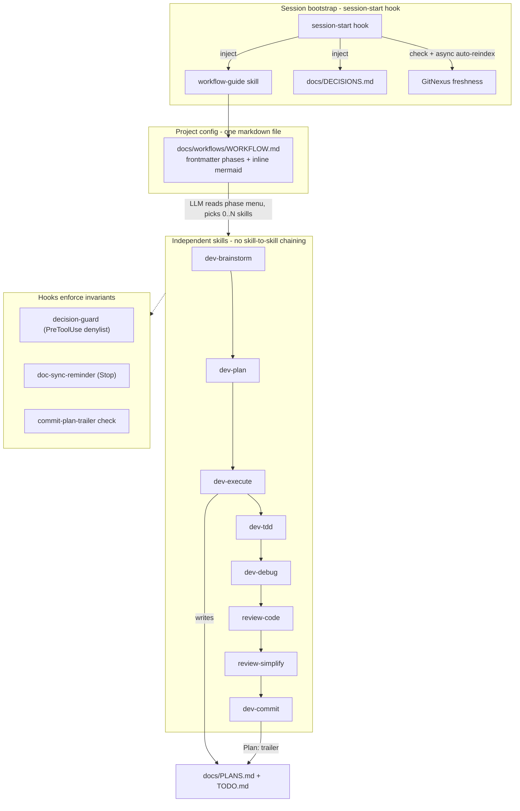

# Luna Agent Kit — System Design

> Phase 0 artifact. Describes the **target** architecture. Components are planned unless this repo
> already contains them. Source of truth for the build is `docs/TOOLS_LIST.md`.

## 1. Purpose

A local-first Claude Code plugin for **daily, gated vibe coding**. It vendors the good parts of
Superpowers (discipline skills), ECC (domain knowledge), and claude-plugins-official (canonical
plugin/hook patterns), while adding the project-local state those plugins lack: decision memory,
plan↔commit traceability, and GitNexus index freshness.

Design tenets:

- **Skills are independent.** No skill references or chain-invokes another. Sequencing lives only in
  `docs/workflows/WORKFLOW.md`.
- **Workflow suggests, the LLM decides.** Each phase lists `suggested_skills`; the LLM runs the
  subset that fits the change.
- **Hooks remind and block — they never orchestrate.**
- **Markdown-only workflow.** One `WORKFLOW.md` (frontmatter + inline Mermaid), no build scripts.
- **Reuse over re-author.** GitNexus skills already exist; we add a freshness hook + a rule, not new
  skills.
- **Names group by category.** Every skill carries a category prefix: `workflow-`, **`dev-`** (core
  lifecycle: dev-brainstorm/plan/execute/tdd/debug/verify/commit/research/audit), `review-`, `doc-`,
  `skill-`, `hook-`, `kwb-`, `design-`. See `docs/TOOLS_LIST.md` for the full map.

## 2. Architecture

## 3. Phased workflow

`WORKFLOW.md` frontmatter defines an ordered set of phases with gates and a per-phase
`suggested_skills` menu, plus `variants` (`trivial`, `fix`, `spike`) that skip phases so small tasks
don't pay full ceremony. Default phases:

`dev-brainstorm → system-design → dev-plan → dev-execute` — with `user_approval` gates on
system-design, plan, and each execute loop. Execute-phase menu suggests:
`dev-tdd, dev-debug, review-code, review-simplify, doc-update-project, doc-update-agent, dev-commit`.

New projects bootstrap their docs with the **`doc-init`** skill (the minimum doc set; see
`docs/TOOLS_LIST.md`). Reviews come in two forms: independent **`review-*` skills** (code, simplify,
security, performance) for inline use, and two optional, user-invoked **agents** —
**`review-internal`** (batches the review skills into one merged report at PR time, in an isolated
subagent) and **`review-external`** (collects structured UI/UX feedback from real users).

Task state uses Claude Code's **native** `TaskCreate`/`TaskUpdate`/`TaskGet`/`TaskList` (persisted in
`~/.claude/tasks/`, broadcast across sessions) — we don't reinvent task tracking, so there is **no**
`workflow-manager` agent. `PLANS.md`/`TODO.md` are the git-tracked, commit-linked layer that
`doc-update-agent` distills from native tasks + `git log` `Plan:` trailers.

## 4. The three enforcement mechanisms

### A. Decision / rejection memory (pain #1)
Three layers, weakest→strongest:
1. **Native Claude Code memory** for cross-project lessons (a rule prompts a `feedback` memory on correction).
2. **`docs/DECISIONS.md`** project-local log, injected by `session-start` so it's always in context.
3. **`decision-guard`** PreToolUse hook reads a project denylist and returns `deny|ask` on a match —
   turning a recurring rejection into a hard block. Tunable via `LUNA_HOOK_PROFILE`.

### B. Plan ↔ commit traceability (pain #7)
- `dev-commit` skill writes `Plan: docs/plans/<file>.md#phase-N` on each commit.
- `scripts/build-plans-registry.mjs` runs `git log --grep '^Plan:'` and regenerates `docs/PLANS.md`
  (plan | phase | last commit | status | resume hint) — derived from git, so it can't drift.
- `docs/TODO.md` rows always link to a plan file + phase, so any backlog item is one hop from resumable.

### C. GitNexus freshness (pain #9)
Staleness = `git rev-parse HEAD` ≠ the repo's indexed `lastCommit` (exposed by `list_repos` /
`group_status`). The `gitnexus-freshness` hook:
- triggers on **SessionStart** and **after `git commit`** only (never per-edit);
- runs the reindex **async / detached** so it never blocks;
- **debounced** (`LUNA_GITNEXUS_DEBOUNCE_MIN`, default 10m);
- **size-capped** (`LUNA_GITNEXUS_MAX_AUTOSYNC_FILES`, default 2000) — large repos prefer
  incremental/changed-scope sync or fall back to a warning;
- **opt-out** via `LUNA_GITNEXUS_AUTOSYNC=off`.
Paired with the `codebase-awareness` rule: query GitNexus for an existing implementation before
writing new code (kills "agent recreates code that already exists").

## 5. Relationship to Claude native workflows (Ultraplan)

Complementary, not competing. Use native `/workflows` for 100+-file sweeps / mass migrations / 16+
parallel agents. Use Luna Agent Kit for day-to-day gated feature work with local hooks, user
approval between phases, and the memory/traceability mechanisms above. Documented as a decision table
in `workflow-guide` and `.claude/rules/workflow.md`.
