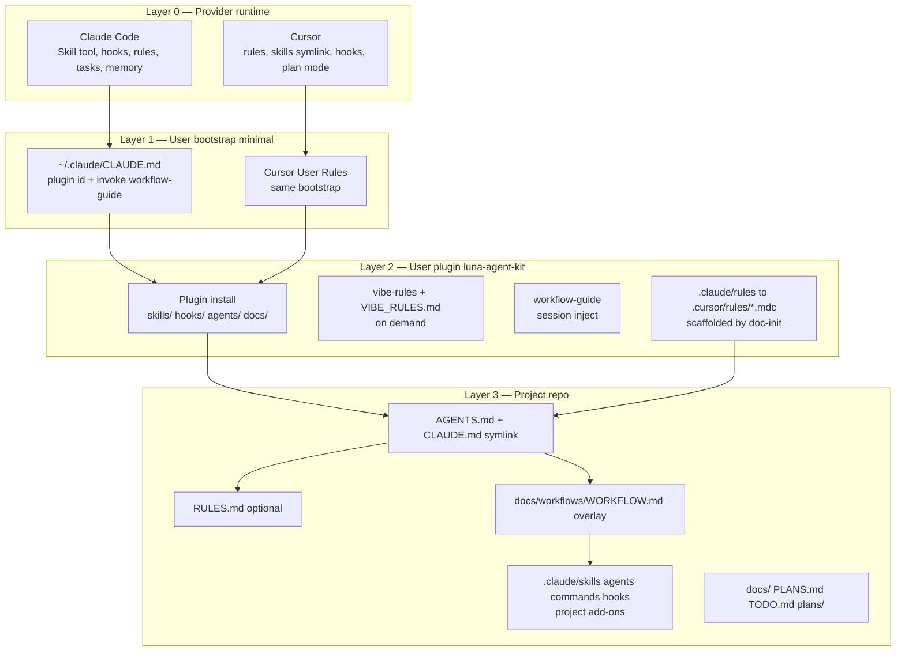
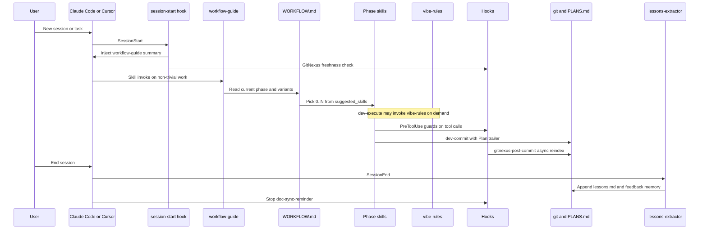
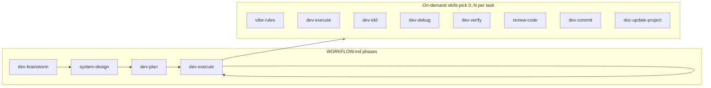

# Luna Agent Kit — System Design

> Architecture for user-level plugin `luna-agent-kit@luna-marketplace`. Component inventory:
> `docs/TOOLS_LIST.md`. Generic engineering rules (on demand): `docs/VIBE_RULES.md` via **`vibe-rules`**
> skill.

## 1. Purpose

Luna Agent Kit is a **user-level plugin** for gated vibe coding across **Claude Code** and **Cursor**.
Project repos add overlays (skills, `RULES.md`, workflow menus); providers supply native runtimes.

It vendors discipline from Superpowers, domain knowledge from ECC, and hook patterns from
claude-plugins-official, while adding project-local state those plugins lack: plan↔commit traceability,
GitNexus index freshness, and a consistent gated workflow.

**Design tenets:**

- **Skills are independent.** No skill chain-invokes another. Sequencing lives only in
  `docs/workflows/WORKFLOW.md`.
- **Workflow suggests, the LLM decides.** Each phase lists `suggested_skills`; the LLM picks the subset.
- **Hooks remind and block — they never orchestrate.**
- **Markdown-only workflow.** One `WORKFLOW.md` (frontmatter + inline Mermaid), no build scripts.
- **Generic vs project rules.** Principles in **`docs/VIBE_RULES.md`** (on demand via **`vibe-rules`**).
  Stack-specific contracts in optional project **`RULES.md`** only.
- **Layer 1 bootstrap is minimal.** `~/.claude/CLAUDE.md`, Cursor User Rules, and
  `~/.cursor/rules/luna-bootstrap.mdc` point at the plugin — not a competing rulebook. **ECC retired**
  at user level; do not reinstall `everything-claude-code` global rules/skills alongside Luna.

## 2. Four layers + instruction priority

**Instruction priority (canonical):**

1. User explicit instructions (direct chat)
2. Project rules (`RULES.md`, `AGENTS.md`, `.claude/rules/` incl. `lessons.md`)
3. Plugin skills (`workflow-guide`, `vibe-rules`, `dev-*`, `review-*`, …)
4. Default model behavior

Layer 1 bootstrap files **point at** Layer 2; they do not duplicate generic engineering rules.

## 3. File map — who owns what at init

### Layer 0 — Provider (native; not authored by plugin)

| Claude Code | Cursor | Role |
|-------------|--------|------|
| `~/.claude/CLAUDE.md` | Settings → User Rules + `~/.cursor/rules/luna-bootstrap.mdc` | User bootstrap (~12 lines); ECC global rules **retired** |
| `~/.claude/settings.json` | `settings.json` | Permissions, plugin enable |
| `~/.claude/tasks/` | — | Native TaskCreate state (cross-session) |
| `~/.claude/projects/<slug>/memory/` | — | Native feedback memory (SessionEnd) |
| Skill tool | `.cursor/skills` symlink | Load `SKILL.md` on demand |

### Layer 2 — Plugin (authored in `luna-marketplace`, installed user-level)

| Path | Load | Role |
|------|------|------|
| `.claude-plugin/plugin.json` | install metadata | Plugin id, version |
| `skills/*/SKILL.md` | on demand | `workflow-guide`, `vibe-rules`, `dev-*`, `review-*`, `doc-*`, `kwb-*`, `design-*`, `gitnexus-*` |
| `agents/*.md` | user-invoked | `execute`, `review-internal`, `refactor-cleaner`, … |
| `hooks/hooks.json` + `scripts/hooks/*.js` + `hooks/session-start` | event-driven | Guards, session inject, lessons extract |
| `docs/VIBE_RULES.md` | on demand | Generic engineering principles |
| `docs/workflows/WORKFLOW.md` | per task | Default phase template (`doc-init` copies) |
| `docs/TOOLS_LIST.md` | reference | Component catalog |
| `templates/` | `doc-init` | Scaffold sources |

### Layer 2 → Layer 3 — Scaffolded per project by `doc-init`

| Claude | Cursor mirror | Load | Role |
|--------|---------------|------|------|
| `AGENTS.md` | reads `AGENTS.md` | always | Project router / kit entry |
| `CLAUDE.md` → `AGENTS.md` | — | always (Claude) | Symlink |
| `.claude/rules/core.md` | `.cursor/rules/core.mdc` | always | Kit mechanics |
| `.claude/rules/workflow.md` | `.cursor/rules/workflow.mdc` | always | Read WORKFLOW.md |
| `.claude/rules/docs.md` | `.cursor/rules/docs.mdc` | always | Doc class split |
| `.claude/rules/git.md` | `.cursor/rules/git.mdc` | always | Commit conventions |
| `.claude/rules/codebase-awareness.md` | `.cursor/rules/codebase-awareness.mdc` | always | GitNexus query-before-write (pointer to vibe-rules §7) |
| `.claude/rules/knowledge-stack.md` | `.cursor/rules/knowledge-stack.mdc` | always | Doc routing; L1–L4 → `vibe-rules` §0 |
| `.claude/rules/vibe-coding.md` | `.cursor/rules/vibe-coding.mdc` | always | Pointer → `vibe-rules` |
| `.claude/rules/lessons.md` | `.cursor/rules/lessons.mdc` | always | Project corrections |
| `.cursor/rules/luna.mdc` | — | always (Cursor) | Kit bootstrap |
| `.cursor/skills` → plugin `skills/` | — | on demand | Same SKILL.md files |
| `.cursor/hooks.json` | — | events | Same hook scripts (absolute paths at init) |
| `docs/workflows/WORKFLOW.md` | same file | per task | Phase menu (project may overlay) |
| `docs/PLANS.md`, `docs/TODO.md` | same | git-tracked | Plan registry + backlog |
| `.jscpd.json` | same | commit hook | Dedupe guard |

### Layer 3 — Project-only (example: flynance-main; not in plugin)

| Path | Role |
|------|------|
| `RULES.md` | Stack invariants + one-line delegation to plugin |
| `.claude/rules/routing.md` | Pointers only |
| `.claude/skills/<project>-*` | Domain skills (e.g. `flynance-implementation-guide`) |
| `.claude/agents/<project>-*` | Domain subagents |
| `.claude/commands/<project>-vibe*` | Walk-away harness (state machine) |
| `.claude/harness.md` | PR / persona gates |
| Project hooks | Domain safety (`migration_guard`, `risk_gate`, …) |

Project **`WORKFLOW.md`** syncs generic phases from the plugin default, then adds project skill names
to `suggested_skills` via **`workflow-update`**. Harness commands stay project-local.

## 4. End-to-end session flow

Claude Code primary path; Cursor is analogous (no SessionStart/SessionEnd hooks — bootstrap via
always-on rules + first message).

**Phase loop (task time):**

**Memory and traceability (session → durable):**

| Mechanism | When | Writes |
|-----------|------|--------|
| Native tasks | In session | `~/.claude/tasks/` |
| `Plan:` trailer | Commit | `git log` → `docs/PLANS.md` via registry script |
| `lessons.md` | Correction in session | `.claude/rules/lessons.md` + `.cursor/rules/lessons.mdc` |
| `lessons-extractor` | SessionEnd | Same + `~/.claude/projects/.../memory/feedback_*` |
| `doc-update-agent` | After plan work | `PLANS.md`, `TODO.md` |
| GitNexus index | Post-commit / PreToolUse | `.gitnexus/` |

## 5. Hooks map (plugin)

| Event | Hook | Effect |
|-------|------|--------|
| SessionStart | `session-start` | Inject `workflow-guide`; freshness advisory |
| PreToolUse Bash | `bash-guards`, `gitnexus-freshness`, `dedupe-guard` | Safety + stale graph gate + clone warn on commit |
| PreToolUse Read/Write/Edit | `secret-read-guard`, `gitnexus-submodule-advisory` | Block secrets; submodule index warn |
| PreToolUse WebFetch | `url-safety-guard` | HTTPS + allowlist |
| PostToolUse Bash | `gitnexus-post-commit` | Async reindex after commit |
| PostToolUse Write/Edit | `file-size-guard` | Advisory on large files |
| Stop | `doc-sync-reminder` | Nudge doc updates |
| SessionEnd | `lessons-extractor` | Haiku pass → lessons + memory |

**Cursor mapping:** `.cursor/hooks.json` — `beforeShellExecution`, `beforeReadFile`, `afterFileWrite`,
`stop`. Node hooks export testable `run()`; Bash guards sequenced via `bash-guards.js`.

All hooks fail-open with `LUNA_*` opt-outs **except** hard safety guards and `gitnexus-freshness`
(returns `ask` rather than serve a stale graph).

## 6. Phased workflow

`WORKFLOW.md` frontmatter defines phases, gates, `suggested_skills`, and variants (`trivial`, `fix`,
`spike`, `refactor`). Default phases:

`dev-brainstorm → system-design → dev-plan → dev-execute`

Execute-phase menu includes `vibe-rules`, `dev-execute`, `dev-tdd`, `dev-debug`, `dev-verify`,
`dev-refactor`, `review-*`, `doc-update-*`, `dev-commit`. Change workflow only via **`workflow-update`**.

Task state: Claude Code native `TaskCreate`/`TaskUpdate`/… (`~/.claude/tasks/`). Git-tracked layer:
`PLANS.md`/`TODO.md` + `Plan:` commit trailers.

## 7. Three enforcement mechanisms

### A. Corrections → rules

1. **`.claude/rules/lessons.md`** — auto-loaded; Cursor mirror `.cursor/rules/lessons.mdc`.
2. **Native memory** — `~/.claude/projects/<slug>/memory/` (not user-level `CLAUDE.md`).

Capture: in-session append on correction; **`lessons-extractor`** at SessionEnd (opt-out
`LUNA_LESSONS_AUTOEXTRACT=off`).

### B. Plan ↔ commit traceability

- `dev-commit` → `Plan: docs/plans/<file>.md#phase-N` trailer.
- `scripts/build-plans-registry.mjs` → `docs/PLANS.md` from `git log`.

### C. GitNexus freshness

- **`gitnexus-freshness`** (PreToolUse) — sync reindex when stale; fail-closed on read ops.
- **`gitnexus-post-commit`** — async reindex after commit.

Full Always/Never rules: **`vibe-rules`** §7. Query-before-write: **`codebase-awareness`** rule.

## 8. Knowledge stack

Read-order table (L1–L4): **`vibe-rules`** §0 or `docs/VIBE_RULES.md` §0.

Doc authoring and catalog rules: `.claude/rules/knowledge-stack.md` → `.cursor/rules/knowledge-stack.mdc`.
`docs/README.md` scaffolded by `doc-init`.

## 9. Luna vs native `/workflows` + cross-tool handoff

Complementary, not competing. Native `/workflows` for 100+-file sweeps; Luna for daily gated work with
local hooks and memory. See `workflow-guide` and `.claude/rules/workflow.md`.

| Component | Claude Code | Cursor |
|-----------|-------------|--------|
| Durable state | `docs/`, git, `PLANS.md`, `TODO.md` | same |
| Skills | plugin `skills/` | `.cursor/skills` symlink |
| Hooks | `hooks/hooks.json` | `.cursor/hooks.json` |
| Rules | `.claude/rules/*.md` | `.cursor/rules/*.mdc` |

**Handoff loop:** plan in one tool → `dev-plan` → other tool implements with `Plan:` trailer → review via
`git log`.

## File index

| Path | Role |
|------|------|
| [docs/TOOLS_LIST.md](TOOLS_LIST.md) | Component inventory |
| [docs/VIBE_RULES.md](VIBE_RULES.md) | Generic engineering rules (on demand) |
| [docs/workflows/WORKFLOW.md](workflows/WORKFLOW.md) | Default phase template |
| [AGENTS.md](../AGENTS.md) | Kit entry for this repo |
| [skills/vibe-rules/SKILL.md](../skills/vibe-rules/SKILL.md) | On-demand rules index |
| [skills/workflow-guide/SKILL.md](../skills/workflow-guide/SKILL.md) | Session orchestration |
| [skills/doc-init/SKILL.md](../skills/doc-init/SKILL.md) | Project scaffold |
