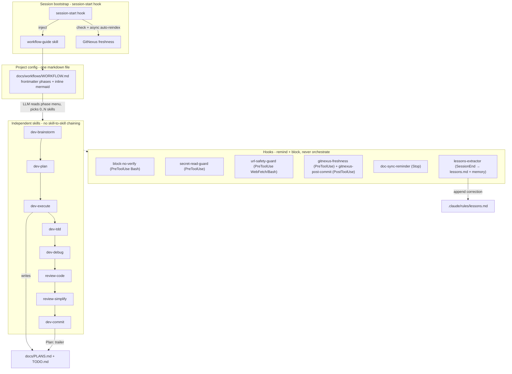

# Luna Agent Kit — System Design

> Phases 1–4 built. Describes the architecture now realized in the repo. Source of truth for the
> component inventory is `docs/TOOLS_LIST.md`.

## 1. Purpose

A local-first Claude Code plugin for **daily, gated vibe coding**. It vendors the good parts of
Superpowers (discipline skills), ECC (domain knowledge), and claude-plugins-official (canonical
plugin/hook patterns), while adding the project-local state those plugins lack: plan↔commit traceability,
GitNexus index freshness, and a consistent gated workflow.

Design tenets:

- **Skills are independent.** No skill references or chain-invokes another. Sequencing lives only in
  `docs/workflows/WORKFLOW.md`.
- **Workflow suggests, the LLM decides.** Each phase lists `suggested_skills`; the LLM runs the
  subset that fits the change.
- **Hooks remind and block — they never orchestrate.**
- **Markdown-only workflow.** One `WORKFLOW.md` (frontmatter + inline Mermaid), no build scripts.
- **Reuse over re-author.** GitNexus skills already exist; we add a freshness hook + a rule, not new
  skills.
- **Names group by category.** Every skill carries a category prefix: `workflow-`, **`dev-`** (core
  lifecycle: dev-brainstorm/plan/execute/tdd/debug/verify/commit/research/audit), `review-`, `doc-`,
  `skill-`, `hook-`, `kwb-`, `design-`. See `docs/TOOLS_LIST.md` for the full map.

## 2. Architecture

> Built hooks (8): `session-start`, `block-no-verify`, `secret-read-guard`, `url-safety-guard`,
> `gitnexus-freshness`, `gitnexus-post-commit`, `doc-sync-reminder`, `lessons-extractor`. Node hooks
> (`block-no-verify`, `secret-read-guard`, `url-safety-guard`, `doc-sync-reminder`) export a testable
> `run()`, sequenced by the `bash-guards` dispatcher so a Bash call spawns one Node process, not three.
> All fail-open with `LUNA_*` opt-outs **except** the safety guards and `gitnexus-freshness`, which
> returns `ask` rather than serve a stale graph (see §"GitNexus freshness" below).

## 3. Phased workflow

`WORKFLOW.md` frontmatter defines an ordered set of phases with gates and a per-phase
`suggested_skills` menu, plus `variants` (`trivial`, `fix`, `spike`) that skip phases so small tasks
don't pay full ceremony. Default phases:

`dev-brainstorm → system-design → dev-plan → dev-execute` — with `user_approval` gates on
system-design, plan, and each execute loop. Execute-phase menu suggests:
`dev-tdd, dev-debug, review-code, review-simplify, doc-update-project, doc-update-agent, dev-commit`.

New projects bootstrap their docs with the **`doc-init`** skill (the minimum doc set; see
`docs/TOOLS_LIST.md`). Reviews come in two forms: independent **`review-*` skills** (code, simplify,
security, performance) for inline use, and two optional, user-invoked **agents** —
**`review-internal`** (batches the review skills into one merged report at PR time, in an isolated
subagent) and **`review-external`** (collects structured UI/UX feedback from real users).

Task state uses Claude Code's **native** `TaskCreate`/`TaskUpdate`/`TaskGet`/`TaskList` (persisted in
`~/.claude/tasks/`, broadcast across sessions) — we don't reinvent task tracking, so there is **no**
`workflow-manager` agent. `PLANS.md`/`TODO.md` are the git-tracked, commit-linked layer that
`doc-update-agent` distills from native tasks + `git log` `Plan:` trailers.

## 4. The three enforcement mechanisms

### A. Corrections → rules (pain #1)
"Don't repeat my mistakes" rides the **native rules mechanism** — no custom log or denylist:
1. **`.claude/rules/lessons.md`** — Claude Code auto-loads everything in `.claude/rules/` at the same
   priority as `CLAUDE.md`, so a captured lesson is always in context. Cursor mirror:
   `.cursor/rules/lessons.mdc` (`alwaysApply`).
2. **Native memory** — a `feedback` memory for cross-project lessons.

Capture is **active**, two ways: (a) in-session, the agent appends a one-line rule to `lessons.md` on
correction (per `.claude/rules/core.md` / `doc-update-agent`); (b) at session end, the
**`lessons-extractor`** hook runs a detached Haiku pass over the transcript, extracts explicit user
pushback, and writes high-confidence corrections to `lessons.md` (+ `.cursor/rules/lessons.mdc`) and a
native `feedback` memory — so a lesson isn't lost if the agent forgets to record it. Fail-open;
opt-out `LUNA_LESSONS_AUTOEXTRACT=off` or a `.claude/.no-reflect` marker. `block-no-verify`,
`secret-read-guard`, and `url-safety-guard` are the always-on hard safety guards.

### B. Plan ↔ commit traceability (pain #7)
- `dev-commit` skill writes `Plan: docs/plans/<file>.md#phase-N` on each commit.
- `scripts/build-plans-registry.mjs` runs `git log --grep '^Plan:'` and regenerates `docs/PLANS.md`
  (plan | phase | last commit | status | resume hint) — derived from git, so it can't drift.
- `docs/TODO.md` rows always link to a plan file + phase, so any backlog item is one hop from resumable.

### C. GitNexus freshness (pain #9)
Staleness = `git rev-parse HEAD` ≠ the repo's indexed `lastCommit` (from `.gitnexus/meta.json`).
Adapted from flynance's proven hooks, split into two:
- **`gitnexus-freshness`** (PreToolUse) — gates **GitNexus read ops** (`query`/`context`/`impact`/
  `detect_changes`/`cypher`). If the index is stale it reindexes **synchronously** so the query reads a
  fresh graph; on failure it returns `permissionDecision:"ask"` (**fail-closed** — never serve a stale
  graph as fresh). Debounced (`LUNA_GITNEXUS_DEBOUNCE_MIN`, 10m) and **size-capped**
  (`LUNA_GITNEXUS_MAX_AUTOSYNC_FILES`, 2000 → large repos warn instead of churn).
- **`gitnexus-post-commit`** (PostToolUse on `git commit`/`merge`) — kicks off the reindex
  **async / detached** so the commit never blocks; an in-flight lock keeps the two hooks from racing.
- Both honor **opt-out** `LUNA_GITNEXUS_AUTOSYNC=off` and pass through when no `.gitnexus/` index exists.

Paired with the `codebase-awareness` rule: query GitNexus for an existing implementation before
writing new code (kills "agent recreates code that already exists").

## 5. Relationship to Claude native workflows (Ultraplan)

Complementary, not competing. Use native `/workflows` for 100+-file sweeps / mass migrations / 16+
parallel agents. Use Luna Agent Kit for day-to-day gated feature work with local hooks, user
approval between phases, and the memory/traceability mechanisms above. Documented as a decision table
in `workflow-guide` and `.claude/rules/workflow.md`.

## 6. Cross-tool (Claude Code + Cursor)

The repo is the source of truth and the handoff bus; both tools read the same in-repo markdown + git,
so neither depends on the other's private state.

| Component | Claude Code | Cursor |
|-----------|-------------|--------|
| Durable state | `docs/`, git, `PLANS.md`, `TODO.md` | same (read natively) |
| Skills (`SKILL.md`) | plugin `skills/` | `.cursor/skills` → symlink to `skills/` |
| Hooks | `hooks/hooks.json` (SessionStart/PreToolUse/PostToolUse/Stop/SessionEnd) | `.cursor/hooks.json` (`beforeShellExecution`, `beforeReadFile`, `stop`) |
| Rules | `.claude/rules/*.md` (auto-loaded) | `.cursor/rules/*.mdc` (`alwaysApply`) |
| Plan authoring | native plan mode | native plan mode |

**Loop:** plan in one tool → `dev-plan` saves a self-contained plan to `docs/plans/` + a `PLANS.md`
row (set `Owner`) → the other tool implements + commits with the `Plan:` trailer → the first tool
reviews via `git log --grep Plan:`.
