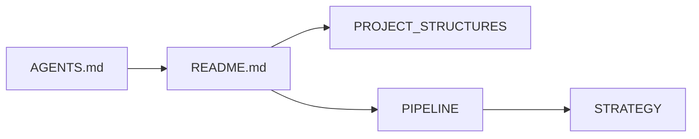

# Knowledge stack examples

Reference artifacts for the `docs/README.md` catalog pattern.

## Template

`templates/docs/README.md` — starter template with placeholder nodes and HTML-comment row stubs.
Copy via `doc-init`; fill catalog rows after surveying your actual project docs.

## Golden reference (local)

| File | What it demonstrates |
|------|---------------------|
| `flynance-main/data-pipeline/docs/README.md` | Full catalog: doc map, catalog table, ownership rules, read order (100 lines) |
| `flynance-main/data-pipeline/docs/PIPELINE.md` | Simplified domain doc: [ref] tags + File index, phases A–F (412 lines; was 1,109) |

Paths assume flynance-main is checked out at `/home/l/REPOS/PROJECTS/flynance-main/`.

## Key patterns from the golden reference

### [ref] tags + File index

Inline long paths → add `## File index` at doc bottom:

```markdown
The [schedules] module runs at 03:00 UTC; see [config] for env overrides.

## File index
| Ref | Path |
|-----|------|
| [schedules] | pipeline/schedules.py |
| [config] | pipeline/config.py |
```

### Ownership table (prevents duplication)

```markdown
| Topic | Canonical doc | Never duplicate in |
|-------|---------------|-------------------|
| Directory layout | PROJECT_STRUCTURES.md | PIPELINE.md |
| Flow responsibilities | PIPELINE.md | DAILY_TRADE_WORKFLOW.md |
| Commands & env vars | AGENTS.md | any docs/*.md |
```

### Doc map (mermaid)


