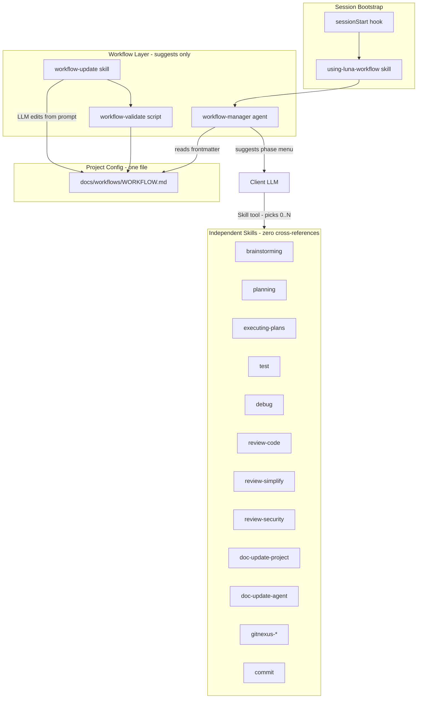
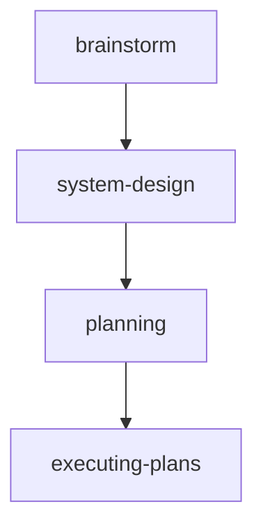

# Luna Agent Kit — Custom Superpowers Plugin Plan

> **⚠️ This document is the original v1 plan, kept for history.** Current design + build state are
> canonical in `docs/TOOLS_LIST.md`, `docs/SYSTEM_DESIGN.md`, `docs/PROJECT_STRUCTURES.md`. Several v1
> ideas below were **superseded** — see the "Superseded" list in Build status before implementing anything.

## Build status — Phases 1–4 complete (eval/acceptance polish outstanding)

Verified 2026-06-15: **36 skills · 7 agents · 6 rules · full hook layer · `build-plans-registry.mjs`**;
**20/20 hook tests pass**; all four phases committed.

| Phase | Scope | Status | Commit |
|-------|-------|--------|--------|
| 0 | Docs scaffold (AGENTS, SYSTEM_DESIGN, PROJECT_STRUCTURE, TOOLS_LIST) | ✅ done | `eb298a4` |
| 1 | Workflow + 12 dev/review skills + session-start/block-no-verify + rules | ✅ done | `e1a8355` |
| 2 | Hook layer (gitnexus-freshness/post-commit, secret/url guards, doc-sync, lessons-extractor), doc skills, meta skills, `build-plans-registry.mjs` | ✅ done | `8d75d73`, `88ea57d` |
| 3 | `kwb-*` knowledge (9) + `dev-research` + `dev-audit` | ✅ done | `126d719` |
| 4 | `design-*` skills + 7 autonomous agents + `dev-parallel` | ✅ done | `bea8944` |
| 4 (polish) | Eval scenarios per rigid skill + acceptance test + `marketplace.json` | ☐ **open** | — |

**Outstanding / known deviations**
- **Eval + acceptance** (`eval-acceptance` todo) — not built; only the 20 hook tests exist.
- `dev-tdd` (362) and `dev-debug` (294) remain verbatim superpowers copies, **>250 lines** (intentional).
- `marketplace.json` — not created (publishing out of scope for now).

### Superseded by later decisions (do NOT implement from the v1 text below)
- **Markdown-only `WORKFLOW.md`** — `workflow-validate/render/extract.mjs` and the `workflow-manager`
  agent were **dropped**.
- **Lessons-as-rules** — `DECISIONS.md` + `decision-guard` + denylist + `hook-flags.js` **removed**;
  corrections ride `.claude/rules/lessons.md` (+ `.cursor/rules/lessons.mdc`) via the `lessons-extractor`
  SessionEnd hook. `block-no-verify` is the one always-on guard.
- **Native plan mode authors; `dev-plan` exports** the approved plan to `docs/plans/` + a `PLANS.md`
  row (now with `Spec` + `Owner` columns).
- **Cross-tool `.cursor/` layer** — skills symlink, `.cursor/hooks.json`, `.cursor/rules/*.mdc` (Claude + Cursor).
- **Renames:** `using-superpowers→workflow-guide`; `dev-` prefix for the lifecycle; `kwb-` for ECC;
  `pr-review`→`review-internal` agent; `human-acceptance-matrix`→`review-external` agent;
  `eval-harness`→opt-in. GitNexus skills are **reused**, not re-authored.

---

## Goals

Build a **self-contained** agent plugin in [luna-marketplace]() (repo root), copying and extending [fork/superpowers](fork/superpowers) rather than depending on the upstream `obra/superpowers` install. **Claude Code first**; Cursor/Codex adapters deferred.

Core improvements over stock Superpowers:

1. **Project-configurable workflows** — global plugin ships atomic skills + **`workflow-update`**; each project owns one **`docs/workflows/WORKFLOW.md`** (skill-shaped, LLM-edited via prompts)
2. **Mermaid over Graphviz** — diagram lives inside `WORKFLOW.md`, not a separate `.mermaid` file
3. **Structured docs** — `AGENTS.md`/`CLAUDE.md`; **project docs** vs **agent workflow docs** (`PLANS.md`, `TODO.md` with plan refs); submodule mirrors
4. **Semi-strict orchestration** — fixed phase vocabulary + gates in frontmatter; **LLM chooses** which independent skills to invoke per phase (menus, not chains)
5. **Phase gates** — workflow lists `suggested_skills` per phase; user approval between phases; session handoff after commit

---

## Architecture



### Design principles

| Principle | Implementation |
|-----------|----------------|
| **Skills are fully independent** | Each skill is self-contained: no `@skill` refs, no "then invoke X", no subagent dispatch to other skills |
| **Workflow suggests, LLM decides** | [`docs/workflows/WORKFLOW.md`](docs/workflows/WORKFLOW.md) frontmatter defines phases + `suggested_skills`; client LLM picks based on context |
| **No orchestrator skills** | Removed `combines-reviews` and similar meta-skills |
| **One workflow file** | No separate `.yaml` + `.mermaid` — avoids drift; Mermaid is a section inside `WORKFLOW.md` |
| **Manager advises** | [`workflow-manager`](agents/workflow-manager.md) parses frontmatter; reports phase + menu; does **not** force skill invocation |
| **User gates** | Frontmatter `gates: [user_approval]` on planning, execute phases, PR review |
| **Hooks enforce invariants** | `phase-checklist` hook reads frontmatter via script; injects menu, not hardcoded chains |

---

## Why one `WORKFLOW.md` instead of `.yaml` + `.mermaid` (or only a global SKILL)?

| Approach | Role | Limitation |
|----------|------|------------|
| [`using-superpowers`](fork/superpowers/skills/using-superpowers/SKILL.md) | **Global** bootstrap: how to find/use skills | Same for every project; not your phase menu |
| Separate `workflow.yaml` + `workflow.mermaid` | Machine + human views | **Drift risk**; manual sync; bad for LLM prompt edits |
| **Single `WORKFLOW.md`** (this plan) | **Project** workflow: skill-shaped doc with YAML frontmatter + Mermaid body | One edit surface; LLM-friendly; validates with script |

**Is the workflow "stricter" than Superpowers?** Only **semi-strict**:

- **Strict:** phase IDs, order, gates, and `suggested_skills` vocabulary (structured frontmatter)
- **Flexible:** which skills to run within a phase, skip optional phases, pick review subset — **client LLM decides**

Superpowers encodes a fixed chain in skill prose (brainstorm → plan → execute). We encode a **menu per phase** in project data instead — stricter vocabulary, looser execution.

### Global vs project workflow (mirrors Superpowers pattern)

```
Plugin (all projects)                    Project (luna-marketplace)
─────────────────────                    ───────────────────────────
skills/using-luna-workflow/SKILL.md  →   docs/workflows/WORKFLOW.md
  HOW to use skills                        WHAT phases/menus this repo uses
  "Read project WORKFLOW.md"               Edited via workflow-update + prompts
hooks/session-start injects bootstrap      doc-update-agent tracks PLANS/TODO
```

Optional discovery aid: [`.claude/skills/project-workflow/SKILL.md`](.claude/skills/project-workflow/SKILL.md) with `description` pointing at the same content — **thin pointer only** (read `docs/workflows/WORKFLOW.md`), not a second copy.

---

## Keeping Mermaid and structured data in sync

**Rule: one file, one edit, one validator.** No manual dual maintenance.

### Source of truth

**YAML frontmatter** in `WORKFLOW.md` holds phases, gates, `suggested_skills`, variants.

**Mermaid block** in the markdown body is a **derived view** — updated in the same LLM edit OR regenerated by script.

### LLM maintenance flow (`workflow-update` skill)

**Yes — to change the workflow, invoke the `workflow-update` skill and describe what you want in plain language.** You do not edit Mermaid or frontmatter by hand in normal use.

Example prompts:
- *"Add audit-idea phase before system-design"*
- *"For fix variant, skip system-design"*
- *"Add review-contracts to executing-plans suggested skills"*
- *"Register a postToolUse hook that reminds doc-update-agent after plan file edits"*
- *"Scaffold a new skill review-contracts for Pydantic API checks"*

**What happens inside `workflow-update`:**

| Your prompt targets | Skill action |
|---------------------|--------------|
| Phases, gates, menus, variants | Patch **YAML frontmatter** in `docs/workflows/WORKFLOW.md` |
| Diagram | Run **`workflow-render.mjs`** (frontmatter → Mermaid section inside same file) |
| Correctness | Run **`workflow-validate.mjs`** (must exit 0 before done) |
| New hook | **Prefer `create-hook` skill.** `workflow-update` may add a minimal stub only if bundled with a workflow change |
| New plugin skill | **Prefer `writing-skills` skill.** `workflow-update` may add a minimal `SKILL.md` stub + `suggested_skills` entry if bundled with workflow change |

**Important:** There is **no separate `.yaml` file**. Structured data lives in **frontmatter at the top of `WORKFLOW.md`**. The script reads that frontmatter and rewrites the Mermaid fenced block in the markdown body:

```
WORKFLOW.md
├── YAML frontmatter  ← source of truth (phases, suggested_skills, …)
├── ## Workflow diagram
│   └── ```mermaid    ← generated by workflow-render.mjs
└── ## Phase reference (optional human table)
```

When the user prompts *"add audit-idea before system-design"*:

1. Invoke **`workflow-update`** skill
2. Read [`docs/workflows/WORKFLOW.md`](docs/workflows/WORKFLOW.md)
3. Patch **frontmatter** (`phases`, `next`, `variants`, etc.)
4. Run **`node scripts/workflow-render.mjs docs/workflows/WORKFLOW.md`**
5. Run **`node scripts/workflow-validate.mjs docs/workflows/WORKFLOW.md`** — must pass
6. If validation fails, fix and re-run (feedback loop)

```bash
# Regenerate mermaid from frontmatter (not from a separate .yaml file)
node scripts/workflow-render.mjs docs/workflows/WORKFLOW.md

# Required after every workflow-update edit
node scripts/workflow-validate.mjs docs/workflows/WORKFLOW.md
```

### What `workflow-validate.mjs` checks

- Frontmatter parses as valid YAML; required keys present (`version`, `name`, `phases`)
- Every `phases[].id` appears as a node in the mermaid diagram
- Every mermaid phase node has a matching frontmatter phase
- `suggested_skills` names exist in plugin `skills/` directory (warn if unknown)
- No duplicate phase IDs; `next` / `variants.skip` reference valid IDs

### What `workflow-render.mjs` does (optional but recommended)

- Reads frontmatter phases + `next` edges + `variants.skip`
- Overwrites only the ` ```mermaid ` … ` ``` ` section between markers `<!-- workflow-diagram:start -->` / `<!-- workflow-diagram:end -->`
- LLM can skip manual mermaid writing — run render script after frontmatter change

**Recommended default for LLM:** patch frontmatter → `workflow-render.mjs` → `workflow-validate.mjs`. Human never maintains Mermaid separately.

**Boundary:** `workflow-update` may **scaffold** minimal hook/skill stubs when your prompt bundles workflow + new component — but full authoring always uses the **independent meta skills** below. `workflow-update` does not chain-invoke them at runtime; it tells you which one to use next if scaffolding is insufficient.

### Meta / authoring skills (independent)

These are **separate** from `workflow-update`. Use them when you are creating or hardening hooks and skills, not just tweaking the workflow menu.

| Skill | Purpose | When to use |
|-------|---------|-------------|
| **`writing-skills`** | Full skill authoring: TDD-for-skills, evals, CSO, pressure scenarios | New non-trivial skill, or improving an existing `SKILL.md` |
| **`create-hook`** | Hook authoring: `hooks.json`, event choice, matchers, `scripts/hooks/*`, fail-open vs fail-closed | New hook or changing hook behavior |
| **`update-skills`** (Phase 2) | Audit existing plugin skills for stale descriptions / drift | Periodic maintenance |
| **`compare-skills`** (Phase 2) | Diff vs ECC / superpowers / claude-plugins-official | Curation decisions |

**Division of labor:**

```
workflow-update     → "change phases/menus" + optional minimal stub files
writing-skills      → "author a proper skill" (standalone)
create-hook         → "author a proper hook" (standalone)
```

Example: *"Add a hook that blocks http URLs"* → use **`create-hook`** (or **`workflow-update`** if you also want it registered in the same prompt — scaffold only, then **`create-hook`** for production quality).

Example: *"Create review-contracts skill with OWASP API checks"* → use **`writing-skills`**; add `review-contracts` to `WORKFLOW.md` `suggested_skills` via **`workflow-update`** in a separate step or same session (two skill invocations, not one orchestrator).

---

## `WORKFLOW.md` format (replaces `workflow.yaml` + `workflow.mermaid`)

Single file at [`docs/workflows/WORKFLOW.md`](docs/workflows/WORKFLOW.md):

```markdown
---
name: default-feature
version: 1
description: Standard feature delivery for luna-marketplace
variants:
  trivial:
    skip: [deep-research, system-design, planning]
  fix:
    skip: [system-design]
  spike:
    skip: [executing-plans]
phases:
  - id: brainstorm
    primary_skill: brainstorming
    outputs: [docs/specs/YYYY-MM-DD-topic-design.md]
    next: system-design
  - id: system-design
    primary_skill: system-design
    gate: user_approval
    next: planning
  - id: planning
    primary_skill: planning
    gate: user_approval
    next: executing-plans
  - id: executing-plans
    primary_skill: executing-plans
    loop: per_plan_phase
    suggested_skills: [test, debug, review-code, review-simplify, review-security, doc-update-project, doc-update-agent, gitnexus-reindex, commit]
    suggested_skill_hints:
      debug: when tests fail
    gate: user_approval
---

# Project workflow

Human-readable summary of this workflow (optional prose).

## Workflow diagram

<!-- workflow-diagram:start -->

<!-- workflow-diagram:end -->

## Phase reference

| Phase | Primary skill | Gate | Suggested skills |
|-------|---------------|------|------------------|
| executing-plans | executing-plans | user_approval | test, debug, review-*, doc-* … |
```

Hooks and `workflow-manager` call `node scripts/workflow-extract.mjs docs/workflows/WORKFLOW.md` to get JSON phase menu (no duplicate parsing logic in each hook).

### Skill Independence Contract

Every skill in `skills/` MUST follow:

1. **No skill-to-skill references** in SKILL.md body (no names of other skills, no "invoke planning next")
2. **No orchestration** — skill does one job and stops; it does not spawn subagents to run other skills
3. **Description = WHEN only** — routing via metadata; body = HOW for that skill alone
4. **Workflow owns sequencing** — only `docs/workflows/WORKFLOW.md` frontmatter lists phases and `suggested_skills`
5. **Conditional selection by LLM** — e.g. at execute phase, workflow suggests `[test, debug, review-*, doc-update-project, doc-update-agent, gitnexus-reindex, commit]`; LLM runs subset based on what changed

Skills that violate independence (split or trim):

| Was coupled | Becomes |
|-------------|---------|
| `combines-reviews` | **Removed** — use independent `review-code`, `review-simplify`, `review-security` |
| `brainstorming` with embedded research | **Split** — `brainstorming`, `deep-research`, `audit-idea` as three skills |
| `executing-plans` with hardcoded substep chain | **Trim** — executing-plans covers plan-phase mechanics only; docs/gitnexus are workflow-suggested, not inlined |
| `doc-update` (monolithic) | **Split** — `doc-update-project` vs `doc-update-agent` (see Documentation skills) |
| `subagent-driven-development` pattern | **Optional execute agent** — `agents/execute.md` implements one task; does not chain review skills |

## Repo layout (repo root)

```
luna-marketplace/
├── .claude-plugin/
│   └── plugin.json                 # name: luna-agent-kit
├── AGENTS.md                       # agent + contributor instructions
├── CLAUDE.md -> AGENTS.md          # symlink
├── README.md                       # human-facing
├── docs/
│   ├── TODO.md                     # agent backlog — each row links to source plan
│   ├── PLANS.md                    # agent plan registry (plan | phase | commit | status)
│   ├── PROJECT_STRUCTURES.md
│   ├── SYSTEM_DESIGN.md            # mermaid architecture
│   ├── workflows/
│   │   └── WORKFLOW.md             # project workflow (frontmatter + mermaid + phase table)
│   ├── specs/                      # design docs from brainstorming
│   └── plans/                      # implementation plans
├── .claude/
│   └── rules/                      # always-on rules (see below)
├── skills/                         # plugin skills (atomic)
├── agents/
├── hooks/
│   └── hooks.json
├── scripts/
│   ├── workflow-validate.mjs       # frontmatter ↔ mermaid sync checks
│   ├── workflow-render.mjs         # regenerate mermaid from frontmatter
│   ├── workflow-extract.mjs        # JSON phase menu for hooks/manager
│   └── hooks/                      # hook implementations
└── fork/                           # reference only (superpowers, ECC) — not loaded at runtime
```

**Submodule doc mirror** (when sub-projects exist): repeat `docs/TODO.md`, `docs/PLANS.md`, `docs/PROJECT_STRUCTURES.md`, plus optional `docs/DESIGN_SYSTEM.md`, `docs/DATABASE_DESIGN.md`, `docs/api/` per module.

---

## Plugin manifest

[`.claude-plugin/plugin.json`](.claude-plugin/plugin.json) — Claude Code canonical layout per [plugin-structure SKILL](fork/claude-plugins-official/plugins/plugin-dev/skills/plugin-structure/SKILL.md):

```json
{
  "name": "luna-agent-kit",
  "version": "0.2.0",
  "description": "Luna marketplace agent workflows: configurable phases, structured docs, GitNexus-aware vibe coding",
  "hooks": "./hooks/hooks.json"
}
```

Omit `"skills"` and `"agents"` paths — Claude Code auto-discovers `skills/` and `agents/` at plugin root ([superpowers pattern](https://github.com/obra/superpowers/blob/main/.claude-plugin/plugin.json), [claude-skills#707](https://github.com/alirezarezvani/claude-skills/issues/707)).

Install locally in Claude Code: `/plugin install .` from repo root (or marketplace entry later).

---

## Skills catalog (phased)

### Phase 1 — MVP (ship first)

| Skill | Source | Notes |
|-------|--------|-------|
| `using-luna-workflow` | Adapt [using-superpowers](fork/superpowers/skills/using-superpowers/SKILL.md) | Global bootstrap; points to `docs/workflows/WORKFLOW.md`; **LLM picks skills** from menus |
| `workflow-update` | New + borrow [dynamic-workflow-mode](fork/ECC/skills/dynamic-workflow-mode/SKILL.md) | Edit `WORKFLOW.md` from prompts; render + validate; optional minimal stub scaffold only |
| `writing-skills` | Copy [fork/superpowers](fork/superpowers/skills/writing-skills/) | **Independent:** full skill authoring (TDD, evals, CSO) |
| `create-hook` | Adapt [create-hook](.cursor/skills-cursor/create-hook/SKILL.md) for Claude Code | **Independent:** hook authoring (`hooks.json`, scripts, matchers) |
| `brainstorming` | Copy superpowers | Design dialogue only — no embedded research/audit steps |
| `deep-research` | Copy [fork/ECC/skills/deep-research](fork/ECC/skills/deep-research/) | Independent; workflow suggests before brainstorm when needed |
| `audit-idea` | New | Feasibility/risk check on a proposed idea or design section — standalone |
| `system-design` | New | Mermaid diagrams; updates `docs/SYSTEM_DESIGN.md` — no call to planning |
| `planning` | Adapt [writing-plans](fork/superpowers/skills/writing-plans/) | Phases, subtasks, validation; deferred scope → `docs/TODO.md` rows (format in TODO template) |
| `executing-plans` | Adapt superpowers `executing-plans` only | Plan-phase mechanics (read plan, implement tasks, mark done) — **no inlined review/doc/gitnexus steps** |
| `test` | New (thin) | Run related unit tests; report pass/fail |
| `debug` | Copy [systematic-debugging](fork/superpowers/skills/systematic-debugging/) | Root-cause only |
| `review-code` | Adapt [requesting-code-review](fork/superpowers/skills/requesting-code-review/) | Logic/correctness — standalone report |
| `review-simplify` | Borrow [code-simplifier](fork/claude-plugins-official/plugins/pr-review-toolkit/agents/code-simplifier.md) patterns | Redundancy, complexity, dead code — standalone |
| `review-security` | Borrow [security-review](fork/ECC/skills/security-review/SKILL.md) | OWASP, secrets — standalone |
| `commit` | New | Conventional commits; user-invoked or after phase gate |
| `gitnexus-guide` | GitNexus bundle | exploring, debugging, impact, refactoring — each independent if split |

**No `combines-reviews`.** At execute phase, workflow `suggested_skills` lists all review skills; LLM runs the subset that fits the diff (all three for large features, only `review-security` for auth change, etc.).

**Phase 2 optional reviews** (also independent): `review-contracts`, `review-tests` (coverage on changed paths).

### Phase 2 — Meta + documentation

| Skill | Purpose |
|-------|---------|
| `update-skills` | Audit plugin skills vs last change; suggest description/CSO fixes |
| `compare-skills` | Side-by-side matrix: ECC vs claude-plugins-official vs superpowers vs `skills/` |
| `doc-simplify` | Merge/split **project** docs; enforce max file length; remove duplicates (see scope below) |
| `doc-simplify-agent` | Optional: dedupe/trim agent tracking files (`PLANS.md`, `TODO.md`, plan frontmatter) |
| `doc-update-project` | Sync **human/project** docs after code changes — see scope table |
| `doc-update-agent` | Sync **LLM workflow** docs — `PLANS.md`, `TODO.md`, plan phase/commit status, session resume hints |
| `pr-review` | Final plan-level review — suggests which `review-*` skills apply to full diff; does not invoke them |
| `chrome-devtools` | MCP browser/CDP workflow skill (Cursor browser MCP patterns) |

#### Documentation skill scopes (independent)

| Skill | Updates | Does NOT touch |
|-------|---------|----------------|
| `doc-update-project` | `docs/SYSTEM_DESIGN.md`, `docs/PROJECT_STRUCTURES.md`, `docs/DATABASE_DESIGN.md`, `docs/DESIGN_SYSTEM.md`, `docs/api/*`, feature folders under `docs/` | `PLANS.md`, `TODO.md`, `docs/plans/*` registry rows |
| `doc-update-agent` | `docs/PLANS.md`, `docs/TODO.md`, plan file frontmatter (phase/status), session handoff block at bottom of active plan | Architecture/design prose in project docs |
| `doc-simplify` | Project doc files listed above | Agent registry files (use `doc-simplify-agent` if needed) |

Both doc-update skills are **independent** — LLM may run one or both after a phase (workflow suggests both; hints narrow choice).

### Phase 3 — Domain knowledge (selective ECC copy)

Copy **content only** (trim to &lt;500 lines SKILL.md + reference files) from [fork/ECC/skills](fork/ECC/skills/):

- `python-patterns`, `python-testing`, `postgres-patterns`, `api-design`, `docker-patterns`, `deployment-patterns` (docker-compose), `frontend-patterns`, `nextjs-turbopack` (Next.js), `coding-standards` (TypeScript baseline)

Skip terraform unless project uses it — add `terraform-patterns` only when `.tf` files exist.

### Phase 4 — Frontend + database

| Skill | Purpose |
|-------|---------|
| `frontend-design` | Style/prompt/URL-driven UI generation |
| `design-system` | Structured design tokens + mock UI |
| `database-design` | dbdiagram.io format → `docs/DATABASE_DESIGN.md` |

---

## Agents

Agents implement **autonomous work units**, not skill chains. They do not invoke other skills or agents except via explicit user/LLM direction.

| Agent | File | Role |
|-------|------|------|
| `workflow-manager` | [`agents/workflow-manager.md`](agents/workflow-manager.md) | Reads `WORKFLOW.md` frontmatter (via extract script) + `docs/PLANS.md`; returns phase + menu + gate status |
| `brainstorm` | [`agents/brainstorm.md`](agents/brainstorm.md) | Socratic design session (optional; main LLM can use `brainstorming` skill instead) |
| `execute` | [`agents/execute.md`](agents/execute.md) | Implements **one** plan task with isolated context; no bundled review |
| `test` | [`agents/test.md`](agents/test.md) | Runs tests for a scoped change; returns evidence |
| `document-project` | [`agents/document-project.md`](agents/document-project.md) | Applies `doc-update-project` / `doc-simplify` to named project doc paths |
| `document-agent` | [`agents/document-agent.md`](agents/document-agent.md) | Applies `doc-update-agent` to `PLANS.md`, `TODO.md`, plan status blocks |

**Removed:** generic `document` agent — split by doc category to match skill independence.

**Removed:** generic `review` agent — reviews are **`review-*` skills** invoked directly by the client LLM when workflow menu + context warrant it.

**Parallel execute:** `dispatching-parallel-agents` pattern (copied from superpowers) remains an **independent skill** for 2+ unrelated tasks; it dispatches `execute` agents, not review agents.

---

## Hooks (Claude Code)

Borrow patterns from [fork/ECC/hooks/hooks.json](fork/ECC/hooks/hooks.json) and [security-guidance](fork/claude-plugins-official/plugins/security-guidance/hooks/hooks.json):

| Hook | Event | Behavior |
|------|-------|----------|
| `session-start` | SessionStart | Inject `using-luna-workflow` (adapt [fork/superpowers/hooks/session-start](fork/superpowers/hooks/session-start)) |
| `url-safety-guard` | PreToolUse (Bash, WebFetch, MCP) | Block/warn `http://` and unknown hosts; require user approval message |
| `doc-sync-reminder` | Stop | If `src/` changed without project doc updates, suggest `doc-update-project`; if phase/plan work without `PLANS.md`/`TODO.md` touch, suggest `doc-update-agent` |
| `phase-checklist` | postToolUse (after phase marker file touch) | `workflow-extract.mjs` → inject current phase `suggested_skills` from `WORKFLOW.md` |
| `secret-read-guard` | PreToolUse Read | Warn on `.env`, keys (from ECC Cursor hook pattern) |
| `block-no-verify` | PreToolUse Bash | Block `git commit --no-verify` (ECC pattern) |

Implement in [`scripts/hooks/`](scripts/hooks/) with [`hooks/hooks.json`](hooks/hooks.json); use `ECC_HOOK_PROFILE`-style env `LUNA_HOOK_PROFILE=minimal|standard|strict` for tuning.

**Note:** Hooks **remind and block unsafe actions**; they inject the workflow `suggested_skills` menu from `WORKFLOW.md`, not hardcoded chains.

---

## Rules ([`.claude/rules/`](.claude/rules/))

Layered like ECC `rules/common/`:

| Rule file | Content |
|-----------|---------|
| `core.md` | NO FALLBACK, fail loud, user rules precedence |
| `workflow.md` | Read `docs/workflows/WORKFLOW.md` for phase menu; invoke independent skills via Skill tool; use **`workflow-update`** to change workflow |
| `docs.md` | Two doc classes: **project** (human/architecture) vs **agent** (`PLANS.md`, `TODO.md`, plans); no ad-hoc `NOTES.md` |
| `security.md` | Secrets, SSRF, http guard |
| `git.md` | Conventional commits; no commit unless asked |
| `python.md` | Pydantic strict, `response_model` (project-specific) |

Keep each rule **under 50 lines**.

---

## Key file templates

### [`AGENTS.md`](AGENTS.md)

- Symlink target for `CLAUDE.md`
- Plugin name, workflow location, instruction priority (user &gt; rules &gt; skills)
- Pointer to `docs/workflows/WORKFLOW.md`; use **`workflow-update`** to customize per project
- Doc update obligations: project docs vs agent workflow docs (see `doc-update-*` skills)

### [`docs/PLANS.md`](docs/PLANS.md) — agent workflow registry

Tracks active and completed plans for session resume and phase gates.

```markdown
# Plans registry

| Plan file | Topic | Phase | Last commit | Status | Resume hint |
|-----------|-------|-------|-------------|--------|-------------|
| docs/plans/2026-06-14-auth-plan.md | auth | 2/4 | abc1234 | in_progress | Continue phase 3 — refresh tokens |
```

Updated by **`doc-update-agent`** after each phase gate or commit (not by `doc-update-project`).

### [`docs/TODO.md`](docs/TODO.md) — backlog with plan refs

Deferred work from planning or mid-execution. **Every row MUST link back to a plan** so resuming is one click.

```markdown
# Backlog

| ID | Task | Plan file | Plan section / phase | Status | Added | Notes |
|----|------|-----------|----------------------|--------|-------|-------|
| T-001 | OAuth refresh token rotation | docs/plans/2026-06-14-auth-plan.md | Phase 3 / §Refresh flow | backlog | 2026-06-14 | Deferred at planning gate — scope too large for current sprint |
| T-002 | Rate limit admin API | docs/plans/2026-06-14-auth-plan.md | Phase 4 / task 4.2 | backlog | 2026-06-15 | Parked after phase 2 review |
```

**Resume workflow** (documented in `doc-update-agent` skill):
1. User picks a `TODO.md` row
2. Open **Plan file** column → read plan at **Plan section / phase**
3. Run `workflow-manager` or paste **Resume hint** from `PLANS.md` into new session
4. On start, `doc-update-agent` moves row `backlog` → `in_progress` and updates `PLANS.md`

`planning` skill appends new rows when deferring scope (uses this table format; does not invoke `doc-update-agent`).

---

## Superpowers copy strategy

1. **Copy** (not submodule) these directories from [fork/superpowers/skills/](fork/superpowers/skills/) into [`skills/`](skills/):
   - `systematic-debugging`, `verification-before-completion`, `test-driven-development`, `using-git-worktrees`, `finishing-a-development-branch`, `receiving-code-review`, `writing-skills`, `writing-plans` (base for `planning`)
2. **Rename/adapt**: `using-superpowers` → `using-luna-workflow`; replace all `digraph` blocks with Mermaid in copied skills
3. **Do not copy** upstream tests/hooks verbatim until adapted for `luna-agent-kit` naming
4. **Leave** [fork/superpowers](fork/superpowers) submodule as reference only; uninstall marketplace `superpowers` plugin to avoid duplicate skill names

---

## Review model (independent skills)

Reviews are **not orchestrated**. The workflow execute phase lists suggested review skills; the client LLM decides:

| Situation | Typical skills to invoke |
|-----------|-------------------------|
| Any code change | `review-code` |
| Large diff or refactor | + `review-simplify` |
| Auth, API, user input, secrets | + `review-security` |
| Schema/API contract change | + `review-contracts` (Phase 2) |

Each review skill outputs its own report (Critical / Important / Suggestion). The LLM merges findings in prose before phase gate — no aggregator skill.

`pr-review` (Phase 2) reads the full plan + commit range and **recommends** which review skills to re-run at PR level; still does not chain-invoke them.

---

## Session handoff (end of each execute phase)

After phase gate (user approval), `executing-plans` or `workflow-manager` output template:

```markdown
## Phase N complete — start fresh session

Plan: docs/plans/YYYY-MM-DD-topic-plan.md
Phase: N/M
Commit: <sha> (run `/commit` or approve commit skill)

### Paste into new Claude session:
Continue luna-agent-kit plan at docs/plans/... phase N+1.
Completed: [summary]. See docs/PLANS.md row for this plan. GitNexus index updated if applicable.
```

(`doc-update-agent` maintains `PLANS.md` resume hint and phase column before handoff.)

---

## Implementation phases

### Phase 1 — Scaffold + workflow engine (week 1)

- Create directory scaffold + `plugin.json`
- `AGENTS.md`, `CLAUDE.md` symlink, `docs/*` skeleton
- Copy/adapt superpowers core skills; Mermaid migration in `using-luna-workflow`
- Implement `docs/workflows/WORKFLOW.md` default from template
- `workflow-update`, `workflow-validate.mjs`, `workflow-render.mjs`, `workflow-manager`, `session-start` hook
- Independent MVP skills: brainstorming, deep-research, audit-idea, system-design, planning, executing-plans, test, debug, review-code, review-simplify, review-security, commit
- `.claude/rules/core.md`, `docs.md`, `security.md`

### Phase 2 — Hooks + doc skills + GitNexus

- Remaining hooks (url guard, doc-sync, phase-checklist)
- `doc-update-project`, `doc-update-agent`, `doc-simplify`, `gitnexus-*` skills
- `pr-review`, `update-skills`, `compare-skills`
- `docs/PLANS.md` + `docs/TODO.md` templates; `doc-update-agent` skill owns registry sync

### Phase 3 — ECC knowledge + domain

- Selective ECC skill copies (python, postgres, api, docker, typescript, nextjs)
- `frontend-design`, `design-system`, `database-design`
- Submodule doc mirror convention in `PROJECT_STRUCTURES.md`

### Phase 4 — Polish

- Eval scenarios (3 per rigid skill, superpowers methodology)
- Claude acceptance test: "Let's make a react todo list" → brainstorming triggers before code
- README for humans; optional Cursor `.cursor-plugin/plugin.json` adapter

---

## Risks and mitigations

| Risk | Mitigation |
|------|------------|
| Skill name collision with installed superpowers | Uninstall marketplace superpowers; unique prefix `luna-agent-kit` plugin |
| Workflow frontmatter drift from Mermaid | Single `WORKFLOW.md`; `workflow-render.mjs` + `workflow-validate.mjs` after every **`workflow-update`** edit |
| Too many skills → poor routing | Strong descriptions; `compare-skills` audit; keep SKILL.md &lt; 500 lines |
| LLM skips suggested reviews | `suggested_skill_hints` in WORKFLOW.md frontmatter; phase-checklist hook; `verification-before-completion` skill |
| Hooks can't enforce full workflow | Workflow menu + user gates; hooks remind, not chain |
| ECC skills are huge | Copy trimmed SKILL.md + one reference file; link to fork for full text |
| Conflicts with Claude ultracode/workflows | Document complementary stance; never double-orchestrate; use workflows for 100+ agent sweeps only |
| Marketplace plugin cache corruption | Local `/plugin install .` from repo root; minimal `plugin.json` (omit `skills` field — auto-discover) |
| Superpowers ceremony on small tasks | `WORKFLOW.md` `variants`: `trivial`, `fix`, `spike` skip phases; calibration table in `workflow-update` template |

---

## Research synthesis (Superpowers, Ultraplan, ECC — issues & user feedback)

Sources: [obra/superpowers issues](https://github.com/obra/superpowers/issues), [anthropics/claude-code workflows docs](https://code.claude.com/docs/en/workflows), [claude-code#45327](https://github.com/anthropics/claude-code/issues/45327), [affaan-m/everything-claude-code issues](https://github.com/affaan-m/everything-claude-code/issues). Reviewed June 2026.

### Competitive comparison

| Dimension | Superpowers | Claude Ultraplan / dynamic workflows | Luna Agent Kit (this plan) |
|-----------|-------------|--------------------------------------|----------------------------|
| Orchestration | Fixed skill chain in prose (brainstorm→plan→SDD) | JS script runtime; plan in code; 16–1000 agents | **Semi-strict** `WORKFLOW.md` menus; LLM picks skills |
| Project customization | Same pipeline every repo | Per-task scripts; save to `.claude/workflows/` | Per-project `WORKFLOW.md` via **`workflow-update`** prompts |
| Observability | Subagent traces opaque (#1725) | `/workflows` UI, per-phase tokens | `docs/PLANS.md`, `TODO.md`, session handoff, optional `progress.json` |
| Resumability | Poor after interrupt (#1725, #1545) | Resume within session (`/workflows`) | Phase + plan refs in agent docs; new session paste hint |
| Small task overhead | Full ceremony always (#1735) | Overkill for tiny tasks | **`variants`** (`fix`, `spike`, `trivial`) skip phases |
| Token cost | High planning + 3× review per task (#1648, #1152) | Very high (many agents) | Lighter: no mandatory SDD; reviews are optional menu picks |
| Reviews | Bundled in SDD (2-stage per task) | Adversarial-verify in script | Independent `review-*` skills; LLM selects subset |
| Hooks / privacy | Local plugin | Ultraplan synced repo to cloud; **bypassed PreToolUse** (#45327) | **Local-first**; hooks apply; no cloud sync |
| Scale | ~15 subagents per plan | Dozens–hundreds | GitNexus + parallel `execute` agent when needed |

### Stance on Claude native workflows (Ultraplan / `ultracode`)

From [superpowers#1647](https://github.com/obra/superpowers/issues/1647) and [Claude workflows docs](https://code.claude.com/docs/en/workflows):

- **Do not compete** with Claude's workflow runtime as a second orchestrator in the same session.
- **Use Claude workflows when:** codebase-wide audit, 500-file migration, deep-research at scale, hard problems needing 16+ parallel agents with `/workflows` observability.
- **Use Luna Agent Kit when:** day-to-day feature work, gated phases, project-specific menus, doc/PLANS/TODO tracking, GitNexus-aware edits, user approval between phases.
- Document this in `using-luna-workflow` and `.claude/rules/workflow.md` as a **decision table** (adopted from #1647 option 1).

### User complaints → our mitigations

| Complaint (source) | Adopt in plugin |
|--------------------|-----------------|
| **Ceremony doesn't scale down** for small repos (#1735) | `WORKFLOW.md` `variants.trivial` / `fix` / `spike`; calibration table in default template; `planning` skill: pin tests/contracts, avoid verbatim scaffolding that breaks on toolchains |
| **Too many tokens** planning + SDD reviews (#1648, #1152) | Independent skills (no 3× review dispatch); optional phases; `agent-sort`-style minimal install via **`compare-skills`** |
| **No resumability** after usage limit / interrupt (#1725, #1545) | **`doc-update-agent`** maintains `PLANS.md` + resume hints; `TODO.md` plan refs; optional `docs/workflows/progress.json` for batch state (Phase 2) |
| **Subagent dialogues fabricated** not real Task calls (#1749) | `executing-plans` skill: require real `Task` tool dispatch; forbid simulated subagent transcripts |
| **Specs leak** into published docs via `docs/superpowers/` (#1690) | Agent specs in `docs/specs/`; design docs in `docs/`; never `docs/superpowers/`; **`doc-update-project`** scope guard |
| **Plan mode blocks skills** (#1667) | Document platform limitation; recommend exiting plan mode for skill-driven work |
| **verification false success** (#1754) | Strengthen `verification-before-completion`; require command output evidence |
| **UI/UX not covered by TDD** (#1664 Human Acceptance Matrix) | Optional **`human-acceptance-matrix`** skill: manual MAT table linked to requirement IDs in specs/plans |
| **No EDD for agent/LLM projects** (#1671) | Port trimmed **`eval-harness`** from ECC for eval-driven iteration alongside unit tests |
| **Plugin cache missing skills** (#1082, marketplace validation) | Ship as **project-local** plugin; minimal manifest; document `rm -rf ~/.claude/plugins/cache` only if needed |
| **ECC hook complexity / JSON failures** (#2239) | Start with **minimal hook set** (5 hooks); `LUNA_HOOK_PROFILE=minimal`; optional **`hook-dry-run`** script (from ECC #2116) previews hook actions without applying |
| **ECC too many skills** — install overwhelm | **`compare-skills`** + curated Phase 1 MVP; don't copy all 262 ECC skills |
| **tdd-workflow lacks plan.md handoff** (#2138 ECC) | `planning` outputs `docs/plans/*.md`; `executing-plans` reads plan as input; `PLANS.md` registry; test spec table optional in plan frontmatter |
| **Ultraplan bypasses hooks / cloud sync** (#45327) | Local plugin only; warn in docs not to use Ultraplan when hooks guard sensitive paths |

### Ideas to add (new plan items)

**Phase 1 / template (high value):**

1. **`WORKFLOW.md` variants** — `trivial` (test→commit), `fix` (skip system-design), `standard`, `large` with calibration hints ([ #1735](https://github.com/obra/superpowers/issues/1735))
2. **Ultracode decision table** in `using-luna-workflow` ([ #1647](https://github.com/obra/superpowers/issues/1647))
3. **Plugin manifest minimal** — only `name`, `version`, `description`, `hooks`; omit `skills` path for auto-discovery ([claude-skills#707](https://github.com/alirezarezvani/claude-skills/issues/707))
4. **`planning` skill rule** — acceptance = tests/contracts, not verbatim file contents that toolchain may invalidate

**Phase 2:**

5. **`progress.json`** (optional) — batch/step state for long executes ([ #1725](https://github.com/obra/superpowers/issues/1725)); `workflow-manager` reads it
6. **`human-acceptance-matrix`** skill ([ #1664](https://github.com/obra/superpowers/issues/1664))
7. **`eval-harness`** skill trimmed from ECC ([ #1671](https://github.com/obra/superpowers/issues/1671))
8. **`workflow-update --dry-run`** or `workflow-preview.mjs` — show diff + rendered mermaid before write (ECC #2116 pattern)
9. **`agent-sort`**-inspired **`compare-skills`** — DAILY vs LIBRARY buckets per repo

**Phase 3 / docs:**

10. Document **complementary use** of `/deep-research` and saved `.claude/workflows/` vs project `WORKFLOW.md`
11. **GitNexus reindex** in execute menu (already planned) — addresses Superpowers' grep-only codebase blindness

### What we intentionally do NOT copy

| Idea | Why skip |
|------|----------|
| Superpowers SDD 2-stage review per task | Token cost; user chose independent review skills |
| Full ECC hook dispatcher stack | Fragile (#2239); start minimal |
| Ultraplan as default orchestrator | Conflicts with skill menus; cloud/hook concerns |
| `docs/superpowers/specs/` path | Leaks to published docs (#1690) |
| Marketplace-only distribution initially | Cache/validation pain (#26555, #1082) |

---

## Out of scope (this plan)

- PR to upstream `obra/superpowers` (project-specific plugin per their AGENTS.md)
- Codex/Cursor/Gemini harness adapters (Claude first)
- Publishing to Claude marketplace (local install only initially)
