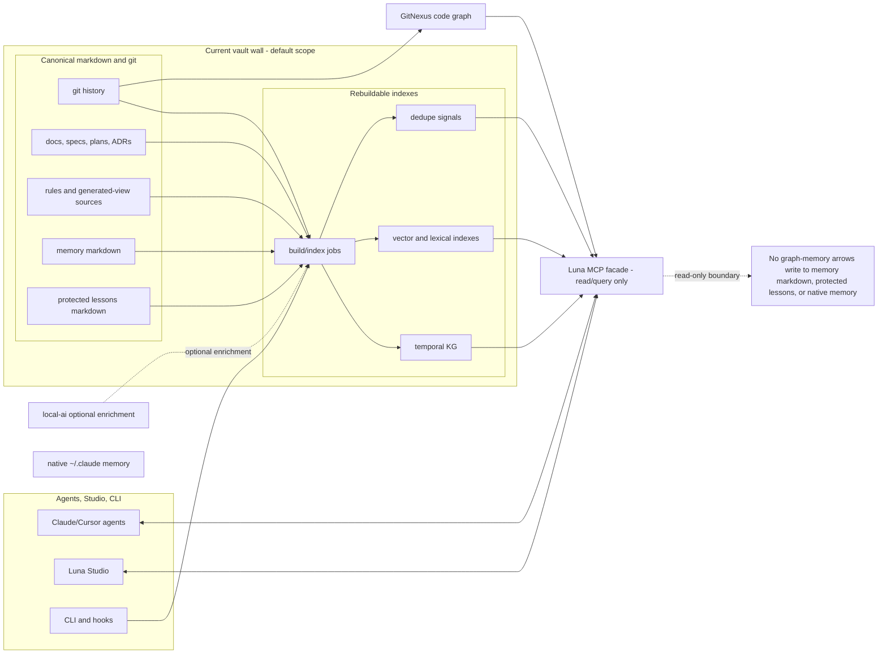
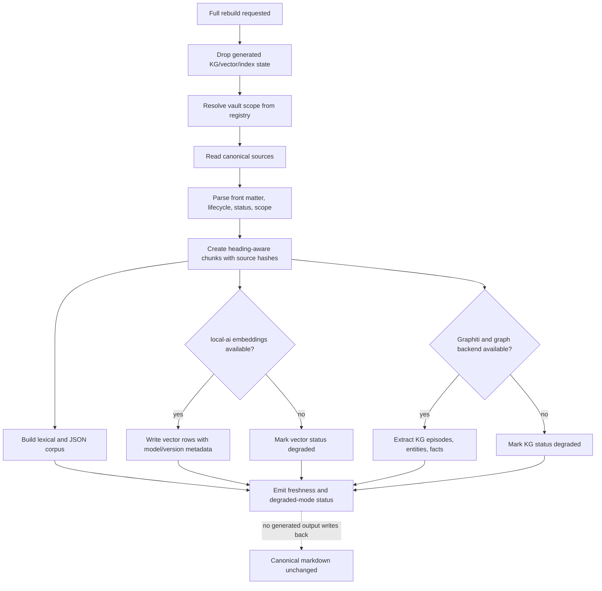
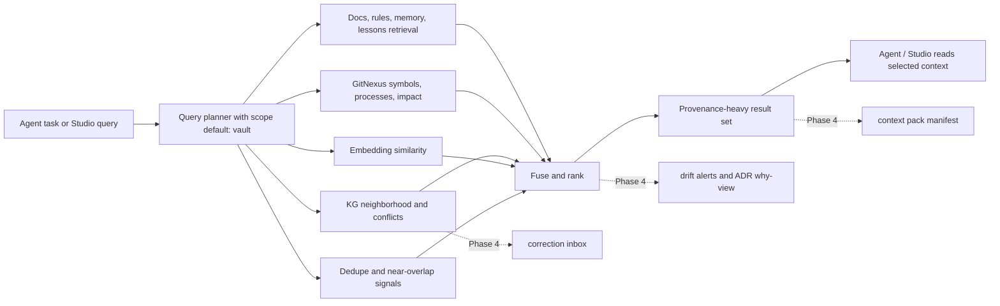

# Graph Memory System Design Decisions

> **Status:** PRE_OFFICIAL draft summarizing the ACTIVE Phase 3 contract spine
> (`docs/specs/2026-07-19-graph-memory-backend-contract.md`). Implementation shipped the
> file-backed rebuildable index + read-only query surface; Graphiti/FalkorDB remain optional
> enrichment adapters (reported unavailable until wired).

## Executive summary

Recommended v1 is a rebuildable graph-memory index over canonical Luna markdown and git, with
Graphiti-style temporal KG, markdown embeddings, GitNexus code context, and dedupe signals fused at
query time [ref:research] [ref:contract]. Markdown + git remain the source of truth; generated KG,
vector rows, JSON feeds, caches, and MCP results are indexes that can be deleted and rebuilt without
data loss [ref:contract] [ref:plan]. MCP should be a narrow read/query facade, never a memory writer,
because direct writes from agents into `memory/*.md`, protected lessons, or native `~/.claude`
memory would create a two-writer system [ref:contract]. `local-ai`, FalkorDB, pgvector, and Graphiti
are enrichment services, not hard dependencies; Studio must keep vault browsing, markdown editing,
sync, and lexical knowledge usable in degraded mode [ref:research] [ref:contract]. Phase 3 should
ship provenance, scope walls, rebuild behavior, and query primitives; Phase 4 should productize
context packs, correction inbox, drift alerts, ADR why-view, and cross-project reuse UX [ref:plan].

Founding invariants:

| Invariant | Design consequence |
|---|---|
| Markdown + git source of truth | KG/vector/JSON/search state is rebuildable index state, not canonical memory. |
| No two-writer memory | MCP graph-memory tools are read/query only; durable writes use existing markdown, protected lesson, lifecycle, or sync flows. |
| Local-first, host-first Studio | Registry paths and vault walls are host truths; graph memory cannot require multi-project Docker or cloud services [ref:host]. |
| local-ai fail-open | Missing models/backends produce degraded status, not blocked Studio workflows. |
| Fleet rules shared, project memory local | Registry search is explicit, read-only, and provenance-labeled; it never copies memory across vaults [ref:fleet]. |

## System context

The important shape is one-way ingestion plus read/query retrieval. Studio and CLI may still edit
canonical markdown through existing explicit flows, but the graph-memory MCP layer must not become
another writer [ref:contract].

## Ingestion / rebuild pipeline

Rebuild acceptance should assert stable source identity, provenance, stale cleanup, and no active
orphan facts. It should not require byte-identical model summaries when model extraction is
nondeterministic [ref:contract].

## Query-time fusion

v1 should expose the lanes and ranking explanation honestly. Phase 4 can make those results durable
as context packs, review queues, drift alerts, and reuse workflows [ref:plan].

## Option comparisons

### Memory architecture

| Option | PROS | CONS | Verdict |
|---|---|---|---|
| Temporal KG / Graphiti-style memory | Captures provenance, evolving relationships, contradictions, valid time, and multi-hop links that matter for stale or superseded repo knowledge [ref:research]. | More operational pieces; extraction can be nondeterministic; graph facts can look more authoritative than their sources unless provenance is strict. | Use as a rebuildable index, not source of truth. Wins under two-writer constraints only when facts always point back to markdown/git and never write memory. |
| Vector RAG | Strong fuzzy recall over prose and mismatched vocabulary; fits local bge-m3/pgvector direction [ref:research]. | Poor at contradiction, lifecycle, and relationship reasoning by itself; stale chunks can mislead agents. | Use as one retrieval lane. It helps local-first recall but does not satisfy authority or stale-context requirements alone. |
| Hybrid KG + vector + lexical + GitNexus | Combines exact fallback, fuzzy recall, graph neighborhoods, code impact, authority ranking, and dedupe signals [ref:research] [ref:contract]. | Requires careful ranking explanations and degraded-mode status; more tests are needed to keep lanes separate. | Recommended. It wins because each lane remains advisory/rebuildable while markdown/git and GitNexus keep the authoritative boundaries. |

### Graph store

| Option | PROS | CONS | Verdict |
|---|---|---|---|
| FalkorDB | Practical Graphiti-first target in the research/contract; local Docker-friendly; supports OpenCypher and graph retrieval features [ref:research] [ref:contract]. | Still adds a service; not a hard dependency if Studio must fail open. | Recommended first target. It best matches the draft contract while remaining optional enrichment under local-first constraints. |
| Kuzu | Embedded local-first shape is attractive; could reduce service overhead if Graphiti compatibility is solid [ref:research] [ref:contract]. | Research confidence is lower; compatibility and schema behavior need a spike before lock-in. | Keep as optional spike. Do not block v1 on it until compatibility is proven. |
| Neo4j / Neptune-style managed graph backends | Serious graph options in the broader Graphiti/backend landscape [ref:research]. | Heavier operational footprint; Neptune/cloud direction conflicts with local-first defaults; Neo4j adds more service weight than v1 needs. | Not v1 default. Consider only if FalkorDB/Kuzu fail specific requirements. |

### MCP role

| Option | PROS | CONS | Verdict |
|---|---|---|---|
| Read/query-only MCP facade | Agents can retrieve context, conflicts, recent changes, and previews while durable writes stay in existing markdown flows [ref:contract]. | Less convenient than generic memory CRUD; Phase 4 must design review/edit UX separately. | Recommended. It is the only option that preserves no two-writer memory and keeps local markdown auditable. |
| Read-write memory server | Generic Graphiti/MCP mutation tools could add facts quickly and support autonomous memory behavior [ref:research]. | Direct writes to `memory/*.md`, protected lessons, or native memory would violate Luna's source-of-truth model and create hidden authority. | Reject for Luna v1. Any accepted memory change must route through canonical markdown/protected-file flows. |

### Index authority

| Option | PROS | CONS | Verdict |
|---|---|---|---|
| Rebuildable index | Deletable/recreatable; easy to audit against git; aligns with existing generated docs and Studio data-layer posture [ref:contract] [ref:plan]. | Requires strong source identity, tombstones/cleanup, and status reporting. | Recommended. It wins because generated knowledge can never outrank markdown/git under local-first and two-writer constraints. |
| Authoritative DB / KG | Faster mutation and richer stateful graph operations. | Hidden truth can drift from docs, git, lessons, and lifecycle state; hard to recover or review. | Reject for Phase 3. It would make graph memory a second source of truth. |

### local-ai dependency

| Option | PROS | CONS | Verdict |
|---|---|---|---|
| Hard dependency | Simpler success path; every environment has embeddings/KG extraction before using graph memory. | Blocks Studio on model/backend availability; contradicts fail-open and host-first local workflow [ref:host]. | Reject. It fails Luna's degraded-mode invariant. |
| Fail-open / degraded enrichment | Studio remains useful with lexical corpus, docs, sync, and vault editing when local-ai or graph services are down [ref:contract]. | More status states and test cases; users must understand what retrieval lanes are unavailable. | Recommended. It wins because local-first means the project works before optional AI enrichment is healthy. |

### Cross-project scope

| Option | PROS | CONS | Verdict |
|---|---|---|---|
| Single-vault default | Strong vault walls; minimizes accidental project-memory bleed; matches project-local memory [ref:fleet] [ref:contract]. | Users must opt in when they want reuse search across projects. | Recommended default. It preserves local memory boundaries. |
| Open multi-vault bleed | High recall across all registered projects with no user friction. | Can leak project-local preferences, stale lessons, or secrets-adjacent context into unrelated work. | Reject. It violates vault-wall and source-authority constraints. |
| Registry-scoped read with walls | Allows "where did another project solve this?" while labeling project/vault/path/source hash and avoiding writes [ref:research] [ref:contract]. | Needs explicit scope controls and clear result provenance; Phase 4 UX is not settled. | Allow as explicit read-only scope. It wins only when provenance is mandatory and no memory is copied across vaults. |

### Identity model

| Option | PROS | CONS | Verdict |
|---|---|---|---|
| Path-keyed source identity | Deterministic, simple, rebuildable; fits current contract and source-hash cleanup [ref:contract]. | Moves/promotions look like old path retired plus new path indexed; historical continuity is weaker. | Recommended for v1 with honest caveat. It wins now because it is testable and source-bound. |
| Logical document IDs | Better continuity across moves, promote/demote, and future temporal UX. | Requires new identity lifecycle decisions and migration rules; could become hidden authority if not source-backed. | Open question for Phase 4 or an amend. Add only if it remains derived from canonical markdown/git metadata. |

## Suggested design

The recommended Phase 3 design is a **hybrid, rebuildable graph-memory index with a read-only MCP
facade**. Build deterministic markdown chunks from canonical docs, rules, memory, protected lessons,
and git metadata; enrich them with local bge-m3 embeddings and Graphiti/FalkorDB KG facts when
available; fuse those lanes with GitNexus code context and dedupe signals at query time [ref:research]
[ref:contract]. FalkorDB should be the first graph backend target, with Kuzu kept as an optional
compatibility spike rather than a v1 blocker [ref:contract]. This design wins because every powerful
memory capability remains downstream of markdown/git, every retrieved claim carries provenance, and
missing AI infrastructure degrades the index instead of blocking Studio.

The design intentionally does less than a generic memory server. It does not expose graph mutation
tools, does not write native Claude memory, does not merge corrections automatically, does not copy
project memory across vaults, and does not replace GitNexus or `jscpd` [ref:contract]. Those limits
are not polish; they are the mechanism that keeps Luna local-first, auditable, and free of a
two-writer memory split.

## v1 vs deferred

| Area | Phase 3 v1 | Deferred to Phase 4 |
|---|---|---|
| Source authority | Markdown + git authoritative; KG/vector/JSON rebuildable. | Same invariant; richer UI around provenance and drift. |
| Ingestion | Heading-aware chunks, source hashes, lifecycle/status/scope metadata. | Better authoring affordances if drift/correction workflows need them. |
| Retrieval | Query lanes and ranking explanation across docs/memory, KG, embeddings, GitNexus, dedupe. | Context pack manifests with token budgets, selected items, and reuse traces. |
| Corrections | Index existing protected lessons and surface conflicts. | Correction inbox for candidate lessons, duplicates, contradictions, stale lessons, and human approval. |
| Temporal graph | Store enough provenance and source identity to support future temporal questions. | User-facing "what was true when?" temporal reasoning UX. |
| Cross-project reuse | Explicit registry-scope read-only query with provenance if included. | Productized reuse search and adapt/copy guidance. |
| Drift | Status and stale-source warnings. | Drift alerts, pack invalidation, ADR why-view. |

## Open questions / gate amends

ACTIVE status still requires gate amends. At minimum, the contract needs:

| Amend | Why it matters |
|---|---|
| Outer-wall language | The current vault wall, plugin/fleet boundary, registry scope, native memory boundary, and generated-index storage boundary must be explicit before implementation. |
| Concrete MCP tool set | The contract says "query tools such as..." but ACTIVE needs the minimum v1 tool names, inputs, outputs, and rejected mutation behavior. |
| Falsifiable failure-mode tests | Existing negative tests should become concrete fixtures/assertions for cross-vault leakage, stale context, orphan cleanup, contradiction surfacing, local-ai degraded mode, generated-view exclusion, GitNexus boundary, and dedupe boundary. |
| Identity caveat | Decide whether path-keyed v1 identity is enough, or whether logical document IDs are required before lifecycle moves become graph sources. |
| Backend lock | Confirm FalkorDB-first, or run the Kuzu compatibility spike before committing the graph backend target. |
| Registry scope UX | Decide whether registry-scope graph queries are CLI-only in Phase 3 or visible in Studio before Phase 4 reuse UX. |

Until those amends land, the contract remains a draft recommendation, not an approved ACTIVE
implementation contract [ref:contract].

## File index

| Ref | Path |
|---|---|
| ref:research | `docs/pre-official/research/2026-07-19-context-engineering-coding-agents.md` |
| ref:contract | `docs/specs/2026-07-19-graph-memory-backend-contract.md` |
| ref:plan | `docs/plans/2026-07-18-luna-studio.md` |
| ref:host | `docs/decisions/2026-07-18-studio-host-first.md` |
| ref:fleet | `docs/decisions/2026-07-18-fleet-rules-canonical.md` |
| ref:frontmatter | `templates/docs/FRONTMATTER.md` |
