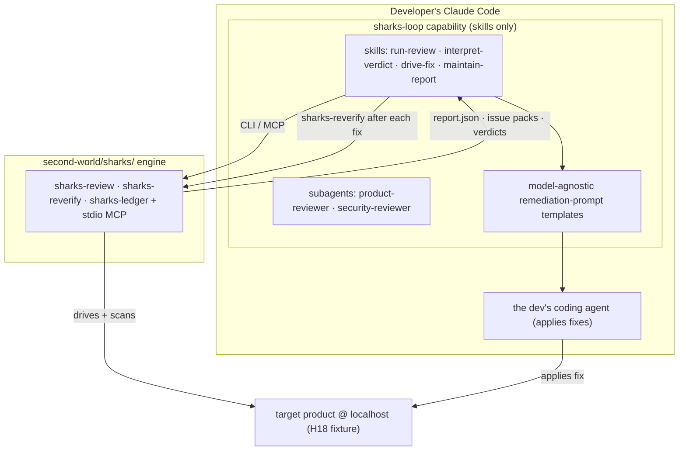
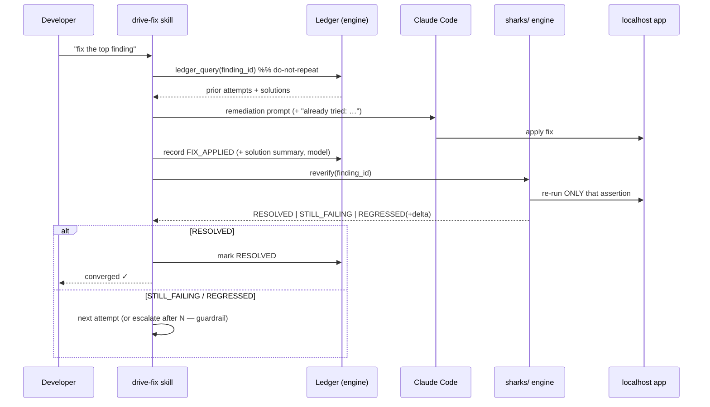

# Spec — Sharks-Loop: a convergence oracle for the coding-agent loop

> **Status:** 2026-07-18 — DESIGN (docs-only; no implementation).
> **Origin:** `dev-brainstorm` session (master spec: `~/.claude/plans/let-s-brainstorm-and-review-elegant-fox.md`).
> **Plan:** `docs/plans/2026-07-18-sharks-loop.md`
> **Engine half (separate repo):** `second-world/docs/CONCEPT_AUDITS/sharks/SHARKS_LOOP_SYSTEM_DESIGN.md`
> **Product name:** "Sharks-Loop" is **provisional** (open decision D2).

---

## 1. Problem

Coding agents cannot verify their own work, so their fix loops never converge — the *"AI doom
loop"* / **Verification Horizon** (arXiv 2606.26300): verifying is now harder than generating, every
verifier is a proxy, and optimization drives reward hacking (26%→58% over 90 steps, arXiv
2605.02964). **luna-agent-kit already ships two memory mechanisms** — corrections→rules and
plan↔commit traceability — but **neither remembers what was found, what fix was applied, or whether
it actually worked.** So an agent re-solves, oscillates (fix A → break B → re-break A), and diverges.

## 2. Proposal — a fourth kit mechanism

Add a **convergence mechanism** to the kit's memory family: an **external, execution-grounded oracle
+ a resolved-issues ledger** that gives the fix loop a termination condition it structurally lacks.

- **Oracle (execution-grounded, not LLM opinion):** drive the real product with synthetic customers
  + OSS security/perf tooling; return a hard PASS/FAIL. The heavy lifting lives in the **second-world
  `sharks/` engine**, invoked over a CLI/MCP seam — **no Python review logic ships in this plugin.**
- **Convergence ledger:** remember every finding + applied fix + verdict, keyed to a version
  snapshot, so the loop never repeats itself and terminates on objective evidence.

This sits alongside — and reuses — the kit's existing plan↔commit + corrections→rules infra.

## 3. Delivery decision — D1 = **split** (resolved 2026-07-18)

The *generic* convergence-ledger + re-verify discipline becomes a **new `luna-agent-kit` mechanism**
(a product-agnostic 4th memory mechanism that helps every project), and the *product-specific*
persona/security **engine stays in `second-world/sharks/`**, invoked over the seam. The `sharks-*`
skills are the thin binding between the two. This keeps the general kit lean *and* reusable, and the
product moat where it belongs.

## 4. Architecture (plugin ↔ engine)

## 5. The convergence loop (core sequence)

## 6. Components (all skills/markdown — no Python here)

- **Skills:** `run-review` (snapshot + invoke engine + surface verdict; explains the *no dev/admin
  login needed* auth options), `interpret-verdict` (rank by severity × behavioral impact + impact viz),
  `drive-fix` (ledger-query-first → prompt Claude Code → reverify → record; attempt-cap guardrail),
  `maintain-report` (converged-vs-open across sessions).
- **Subagents:** `product-reviewer`, `security-reviewer` — *interpreters/orchestrators only*.
- **Prompt templates:** model-agnostic, numbered, acceptance criterion = the re-verify assertion.

## 7. Scope guards

No Python review logic in the plugin · complements (never replaces) the coding agent as fixer ·
security = OSS-reuse (ZAP now) via the engine · localhost/fixture only (H18) until G3+G5.

## 8. Decisions (2026-07-18)

**Resolved:** **D1** = split (kit mechanism + second-world engine) · **D2** = keep "Sharks-Loop"
provisional · **D3** = **MCP server in v0** (native Claude Code tools; console scripts alongside) ·
**D4** = engine docs live in `second-world/docs/CONCEPT_AUDITS/sharks/` (**PRE_OFFICIAL**), per the
doc-lifecycle improvement in `docs/specs/2026-07-18-doc-lifecycle-pre-official-post.md`.
**Still open (build-time):** staging Firebase project vs emulator · `identity_mode` default · attempt-cap value.

## 9. Cross-references

Engine design + build: `second-world/docs/CONCEPT_AUDITS/sharks/SHARKS_LOOP_SYSTEM_DESIGN.md` +
`SHARKS_LOOP_IMPLEMENTATION_PLAN.md` · Kit architecture: `docs/SYSTEM_DESIGN.md` · Kit conventions:
`AGENTS.md`, `docs/PROJECT_STRUCTURES.md` · Doc lifecycle: `docs/specs/2026-07-18-doc-lifecycle-pre-official-post.md`.
