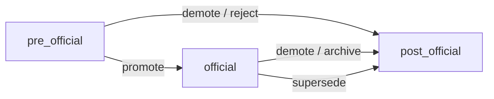

# Contract — doc lifecycle promote / demote / supersede

> **Status:** ACTIVE (Task 4) — signed off 2026-07-19.
> Implements the two canonical moves from
> `docs/specs/2026-07-18-doc-lifecycle-pre-official-post.md` §3 / §4, exposed in Studio
> and owned by `doc-update-project` / `doc-update-agent` via **one** shared lib path.

## 1. Purpose / scope honesty

**v1:** single-doc **promote** / **demote** / **supersede** that (1) rewrites front-matter
(`lifecycle`, `status`, optional `superseded_by` / `supersedes`, server-stamped `updated`)
and (2) when the lifecycle→folder mapping requires it, **moves** the file with git-rename
semantics — then commits. Studio UI and the `doc-update-*` skills call the **same** lib
function so on-disk results are byte-identical.

**Non-goals (lifecycle spec §5 + this gate):**

| Out of v1 | Why |
|-----------|-----|
| Mass / batch migration | Spec forbids; one doc per op |
| Auto-promotion heuristics | Human / skill / UI explicit action only |
| Restore (`post_official` → `official`) | Illegal in the v1 state machine |
| Root architecture docs (`SYSTEM_DESIGN.md`, …) | Outside vault-crud writable prefixes today |
| Rewriting historical `Plan:` trailers | Immutable audit log — see §7 |
| Fleet-managed `rules/` names | Read-only on consumers; not lifecycle docs — see §9 |

## 2. Authority: front-matter first, folder derived

1. **Front-matter `lifecycle` is authority** for tooling and `--check`.
2. **Folder is derived** from `(lifecycle, type, basename)` via the single mapping in §3.
3. Op order is always: **validate transition → compute dest → rewrite FM → move (if needed) → refresh docs-index → one commit**.
4. Callers never invent a destination outside the mapping (optional `destSubdir` only selects *within* the mapped bucket — e.g. `research` vs `audits` under `pre-official/`).

## 3. Lifecycle → folder mapping (one source of truth)

Derived from `templates/docs/FRONTMATTER.md` + lifecycle spec §3. Used by the mutator
**and** by `--check`.

| `lifecycle` | `type` | Default relative directory |
|-------------|--------|----------------------------|
| `pre_official` | any (docs) | `docs/pre-official/research/` (override subdir: `audits`) |
| `official` | `spec` | `docs/specs/` |
| `official` | `plan` | `docs/plans/` |
| `official` | `decision` | `docs/decisions/` |
| `official` | other docs types | `docs/specs/` |
| `post_official` | `plan` | `docs/post-official/completed-plans/` |
| `post_official` | non-plan | `docs/post-official/legacy/` |

**Basename is preserved** on move (`foo.md` → `<destDir>/foo.md`).

### Folder-exempt zones (tag-only)

| Prefix | Behavior |
|--------|----------|
| `memory/` | Lifecycle / status flip **in place** — no `git mv`. Memory has no pre/post bucket. |
| `rules/` | **Out of scope** — reject (`PATH_ZONE` / `LIFECYCLE_SURFACE`); see §9 |

`--check` never flags `memory/*` for tag↔folder mismatch. It **does** flag any
`docs/**` file whose `lifecycle` does not match the table above (e.g. `lifecycle:
post_official` sitting in `docs/specs/`).

## 4. Legal transition state machine



| Op | Edge | FM effects | Move? |
|----|------|------------|-------|
| **promote** | `pre_official` → `official` | `lifecycle: official`; `status: active` (unless already `active`) | Yes (unless folder-exempt) |
| **demote** | `official` → `post_official` **or** `pre_official` → `post_official` | `lifecycle: post_official`; `status: done` | Yes (unless folder-exempt) |
| **supersede** | `official` → `post_official` | `lifecycle: post_official`; `status: superseded`; **requires** `superseded_by` | Yes (unless folder-exempt) |

**Illegal (reject with `TRANSITION_ILLEGAL`):**

- Any jump that skips or reverses the diagram (`post_official` → anything; `official` → `pre_official`; `pre_official` → `official` via demote; promote from `official` / `post_official`)
- `supersede` without a non-empty `superseded_by` path
- `supersede` whose `superseded_by` does not resolve to an **existing** file that passes `assertAllowedPath` (same vault)
- Op whose current FM `lifecycle` does not match the source file’s expected edge start
- Source already at destination path with target lifecycle (noop is not an error for CLI `--check`; apply returns `NOOP` / ok with no commit)

**Supersede pointer rules:**

- `superseded_by` is a vault-relative path (posix, no `..`)
- Replacement must exist **before** the move commits
- v1 does **not** auto-set `supersedes:` on the replacement (caller / separate update may)
- v1 does **not** rewrite other docs’ incoming links to the old path

## 5. Move = git rename semantics + commit convention

### 5.1 Rename

- Perform a **history-preserving rename** (`git mv` or equivalent: filesystem rename + stage
  both ends so git records a rename, not copy+delete of content-identical blobs with lost ancestry).
- **Do not** copy then delete.
- Reuse vault-crud primitives: `assertAllowedPath` on **source and computed dest**,
  `commitPaths` for the final commit, docs-index refresh when any path is under `docs/`,
  `VAULT_BUSY` on `.git/index.lock`.

### 5.2 Who commits + message / trailer

| Rule | Value |
|------|-------|
| Committer | The mutator (Studio gateway or skill CLI) via `commitPaths` — same as CRUD |
| Message | `docs(lifecycle): <op> <src> → <dest>` (dest may equal src for tag-only) |
| `Plan:` trailer | **Never** |

**Justification (no `Plan:` trailer):** lifecycle moves are doc-maintenance / archival, not
plan-phase implementation work. Attaching `Plan: docs/plans/…#phase-N` would falsely
attribute archival commits to an active phase and churn `PLANS.md` the same way the
registry-rebuild and fleet `--commit` paths already refuse trailers for bookkeeping.

Optional caller `planTrailer` is **ignored / rejected** on lifecycle ops (`TRAILER_FORBIDDEN`)
so UI/skills cannot accidentally smuggle one.

### 5.3 Atomicity

On commit failure: restore source bytes + path (roll back FM write and rename). Same
discipline as vault-crud create/update rollback. Docs-index refresh runs **after** successful
rename+FM write and **before** commit; on commit failure, re-run index restore best-effort
then surface `GIT_COMMIT`.

## 6. Path confinement + no-clobber + TOCTOU

Both endpoints must pass the existing vault wall:

1. Vault from `resolveVaultRoot` / gateway `vaultId` only (no client roots).
2. `assertAllowedPath(root, src)` and `assertAllowedPath(root, dest)` — dest computed
   server-side; reject `..`, escapes, generated trees, protected basenames.
3. **No-clobber:** if `dest !== src` and `existsSync(dest)` → `DEST_EXISTS` (refuse). Same
   spirit as CRUD `EXISTS`.
4. **TOCTOU / planToken:** preview → apply pattern (parity with sync):
   - `vaultLifecyclePreview` returns `{ plan, planToken, … }` where `planToken` binds
     `op + src + dest + sourceSha256 + desiredFmCanonical + superseded_by?`
   - `vaultLifecycleApply` re-derives the plan, requires matching `planToken`, else `PLAN_STALE`
   - Re-check dest absence immediately before rename
5. Source identity: apply requires current source sha256 match (embedded in token) — stale
   edits → `PLAN_STALE`, not a blind overwrite.
6. Gateway: per-vault mutex + `VAULT_BUSY`; unknown payload keys rejected; body/path
   validation unchanged from studio-server-actions contract.

## 7. 🔴 Plan-move vs `PLANS.md` registry ripple

### Problem

`build-plans-registry.mjs` groups commits by the **literal** path in `Plan:` trailers
(`docs/plans/<file>.md#phase-N`). Those trailers are historical. Physically moving a
completed plan to `docs/post-official/completed-plans/` would leave registry rows pointing
at a path that no longer exists — unless we decide otherwise.

Dogfood already has a moved plan at
`docs/post-official/completed-plans/2026-07-18-doc-lifecycle-restructure.md`
(lifecycle spec §75–77 and Phase 5 expect this shape).

### Decision (load-bearing)

| Choice | Verdict |
|--------|---------|
| Keep plans in place + tag-only | **Rejected** — contradicts adopted lifecycle moves + Phase 5 Completed-table intent |
| Redirect stub at old path | **Rejected** — dual files forever; agents still open the stub |
| **Move + registry resolves** | **Adopted** |

**Rules:**

1. **Physical move of `type: plan` is allowed** (and required on demote/supersede when not
   folder-exempt) into `docs/post-official/completed-plans/<basename>`.
2. **`Plan:` trailer paths are immutable logical plan IDs** — never rewrite git history.
3. **`build-plans-registry.mjs` MUST resolve** current on-disk location when rendering:

   ```
   logicalId = trailer path (e.g. docs/plans/foo.md)
   if exists(logicalId) → currentPath = logicalId          # active / still official
   else if exists(docs/post-official/completed-plans/<basename(logicalId)>)
        → currentPath = that path                          # archived
   else → currentPath = null (dangling; row still emitted with Status warning)
   ```

4. **Active vs Completed tables:** if `currentPath` is under `post-official/completed-plans/`,
   the row goes in a **Completed** section (or table); otherwise the existing Active table.
   This is the **minimal** registry change required so Task 4 moves do not strand the
   registry. Phase 5 may polish presentation; it must not re-litigate resolution.
5. **Provenance:** human columns in `PLANS.md` stay keyed by **logicalId** (trailer path),
   not by the moved path — so Owner/Spec/Resume survive archive.
6. **Acceptance pin:** hermetic fixture with `Plan: docs/plans/fixture.md#phase-1` commits +
   file moved to `completed-plans/fixture.md` → registry lists fixture under Completed with
   resolvable link; Active table does not claim a live `docs/plans/fixture.md`.

## 8. One procedure, two surfaces (skill ownership)

### Library (single implementation)

```
scripts/lib/doc-lifecycle.mjs   # NEW — pure mutator + check + mapping
  LIFECYCLE_FOLDER_MAP          # §3 table (exported)
  assertTransition(op, fromLifecycle)
  deriveDest(relPath, { lifecycle, type, destSubdir? })
  checkLifecycleDrift(root) → { mismatches: [...] }
  planLifecycleMove({ vault, relPath, op, supersededBy?, destSubdir? })
  applyLifecycleMove({ vault, plan, … })   # or planToken path via gateway
  # Skill/CLI and gateway both call these — no divergent git mv instructions
```

Gateway adds:

```
vaultLifecyclePreview / vaultLifecycleApply
```

CLI (skill-facing):

```
node scripts/doc-lifecycle.mjs <promote|demote|supersede> <relPath> …
node scripts/doc-lifecycle.mjs --check [--root|--vault-id]
```

### Skill ownership (document the procedure — no manual `git mv`)

| Skill | Owns |
|-------|------|
| `doc-update-agent` | **Archival / demote** of agent-class docs: completed plans → `completed-plans/`; reject pre→post when a concept is abandoned |
| `doc-update-project` | **Supersede** of project-class docs: official designs/specs → `legacy/` with `superseded_by`; promote pre→official when a concept is adopted |

Both skills MUST:

1. Call `planLifecycleMove` / `applyLifecycleMove` (or the CLI wrapper) — **never** hand `git mv`
2. Pass through the same FM + transition rules
3. Point at this contract as the canonical procedure

Skills currently contain **no** promote/demote language — Task 4 updates both `SKILL.md` files
as part of implementation (not optional docs polish).

## 9. Surface scoping (Studio UI)

| Surface | Promote / demote / supersede? |
|---------|-------------------------------|
| Docs tab (`docs/specs`, `plans`, `pre-official`, `post-official`, `decisions`) | **Yes** |
| Memory tab (`memory/*`) | **Yes** (tag-only; §3) |
| Rules tab (`rules/*`, fleet-managed generated views) | **No** — hide controls; lib rejects |

Fleet contract §2: consumer Rules are read-only for fleet-managed names. Lifecycle ops do
not apply to rules on plugin or consumers. Confirm UI never offers the action on the Rules
tab.

## 10. Drift detection (`--check`)

```
node scripts/doc-lifecycle.mjs --check
```

Walks allowed doc prefixes under the vault (not `memory/`, not `rules/`). For each `.md`
with parseable FM:

- If `lifecycle` present and path’s directory is not in the §3 set for that
  `(lifecycle, type)` → emit mismatch `{ path, lifecycle, expectedDirs, actualDir }`
- Exit `0` when clean; `1` when ≥1 mismatch; non-zero also on parse hard-fail of the walk

Does **not** write. Studio may surface the same report via a gateway read helper later;
v1 acceptance is CLI/lib.

## 11. Library / gateway / UI surface (implementation sketch)

```
scripts/lib/doc-lifecycle.mjs     — mapping, transitions, plan/apply, check
scripts/doc-lifecycle.mjs         — CLI
scripts/lib/vault-gateway.mjs     — vaultLifecyclePreview / Apply (reuse mutex, tokens, normalizeError)
scripts/build-plans-registry.mjs  — §7 resolution + Completed section
studio/… VaultWorkspace Docs/Memory — action affordances + preview/confirm
skills/doc-update-agent/SKILL.md  — archival procedure → lib/CLI
skills/doc-update-project/SKILL.md — supersede / promote procedure → lib/CLI
```

Reuse only: `resolveVaultRoot`, `assertAllowedPath`, `commitPaths`, `parseFrontmatter` /
`serializeFrontmatter`, `validateFrontmatter`, docs-index refresh, gateway planToken /
`VAULT_BUSY` patterns. **No parallel mutation path.**

## 12. Acceptance (Task 4 gate — not clean-only)

Hermetic tests + `npm run studio:typecheck` clean.

- [x] **Promote** `pre_official` → `official`: FM updated + file under mapped official dir +
      history-preserving rename in git + `docs(lifecycle): promote …` commit **without**
      `Plan:` trailer
- [x] **Supersede** with real existing `superseded_by` target: status `superseded`, moved to
      `post-official/legacy/` (or `completed-plans/` if `type: plan`)
- [x] **Illegal transition** rejected (`TRANSITION_ILLEGAL`) — no write, no commit
- [x] **Destination collision** refused (`DEST_EXISTS`)
- [x] **`--check`** catches hand-induced tag↔folder drift (e.g. `post_official` file left in
      `docs/specs/`)
- [x] **Plan-move (§7):** after moving a plan, `build-plans-registry.mjs` lists it under
      Completed via basename resolution; Active table not stranded on a missing
      `docs/plans/…` path; logicalId / human columns preserved
- [x] **Parity:** skill/CLI procedure and gateway op yield **byte-identical** on-disk results
      (same FM bytes + same final path) on the same fixture
- [x] Rules / fleet-managed names rejected; UI affordance absent on Rules tab
- [x] `memory/` tag-only (no move); docs paths move when mapping requires
- [x] Hermetic tests; `studio:typecheck` clean

## 13. Out of scope

- Batch / mass migrate existing docs
- Auto-promote on merge / phase-done heuristics
- `post_official` → `official` restore
- Auto-updating inbound wikilinks / `related:` / other docs’ `supersedes` on move
- Widening vault writable prefixes to root architecture docs
- Playwright E2E (unit/hermetic + typecheck sufficient for this gate)
- Phase 3 KG re-ingest on move

## File index

| Ref | Path |
|-----|------|
| This contract | `docs/specs/2026-07-19-doc-lifecycle-promote-demote-contract.md` |
| Lifecycle stages | `docs/specs/2026-07-18-doc-lifecycle-pre-official-post.md` |
| Front-matter schema | `templates/docs/FRONTMATTER.md` |
| Vault CRUD | `docs/specs/2026-07-18-vault-crud-contract.md` |
| Gateway boundary | `docs/specs/2026-07-18-studio-server-actions-contract.md` |
| Fleet surface (rules RO) | `docs/specs/2026-07-19-fleet-sync-contract.md` |
| Lifecycle lib | `scripts/lib/doc-lifecycle.mjs` |
| Lifecycle CLI | `scripts/doc-lifecycle.mjs` |
| Plans registry | `scripts/build-plans-registry.mjs` |
| Gateway | `scripts/lib/vault-gateway.mjs` |
| Studio vault UI | `studio/src/components/VaultWorkspace.tsx` |
| Skills | `skills/doc-update-agent/SKILL.md`, `skills/doc-update-project/SKILL.md` |
| Studio plan | `docs/plans/2026-07-18-luna-studio.md` |
