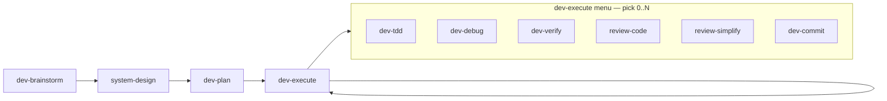

# Project workflow

Phases and gates are defined in the YAML frontmatter above. The LLM reads the current phase's
`suggested_skills` menu and runs the subset that fits the change. Skills are **independent** — none
chains into another. Hooks remind and block; they do not orchestrate.

## Phase flow

## Variants

| Variant | Skips | When |
|---------|-------|------|
| `trivial` | dev-brainstorm, system-design | Typo, one-line fix, obvious change |
| `fix` | dev-brainstorm, system-design | Known bug, clear reproduction |
| `spike` | dev-plan | Exploration/prototype, time-boxed |
| `refactor` | dev-brainstorm, system-design | Dedupe/cleanup sprint — dev-refactor; plan in docs/plans/ |

## Changing this file

Use the **`workflow-update`** skill only — do not hand-edit phases ad hoc.
