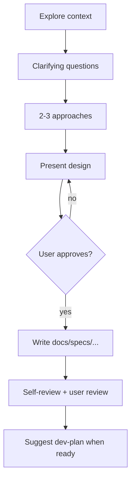

# Dev brainstorm

Turn ideas into approved designs through dialogue. **Independent skill** — does not auto-invoke `dev-plan`; suggest it after user approves the spec.

<HARD-GATE>
Do NOT write implementation code, scaffold projects, or take implementation actions until design is presented and the user approves.
</HARD-GATE>

## Checklist

Create a task for each; complete in order:

1. **Explore context** — files, docs, recent commits; query GitNexus for related code (on a
   multi-module repo use `group_query` to search every module at once — reuse beats rebuild)
2. **Ask clarifying questions** — one at a time; prefer multiple choice
3. **Propose 2–3 approaches** — trade-offs + recommendation
4. **Present design** — scaled to complexity; user approval per section for large designs
5. **Write spec** — `docs/specs/YYYY-MM-DD-<topic>-design.md` (NOT `docs/superpowers/`). Add a `> Plan:` line at the top (fill in once `dev-plan` creates the plan) so spec↔plan cross-link.
6. **Spec self-review** — fix placeholders, contradictions, ambiguity inline
7. **User reviews spec** — wait for approval before implementation planning

## Process flow

## After approval

- Tell the user the spec path and offer **`dev-plan`** for an implementation plan.
- Do **not** invoke other implementation skills in the same turn unless the user asks.

## Principles

- One question at a time
- YAGNI — cut unnecessary scope
- Follow existing codebase patterns when extending
- Large multi-subsystem requests → decompose into sub-projects first

## Visual work

For layout/mockup questions, use frontend/canvas tools when visuals help; conceptual questions stay in chat.
