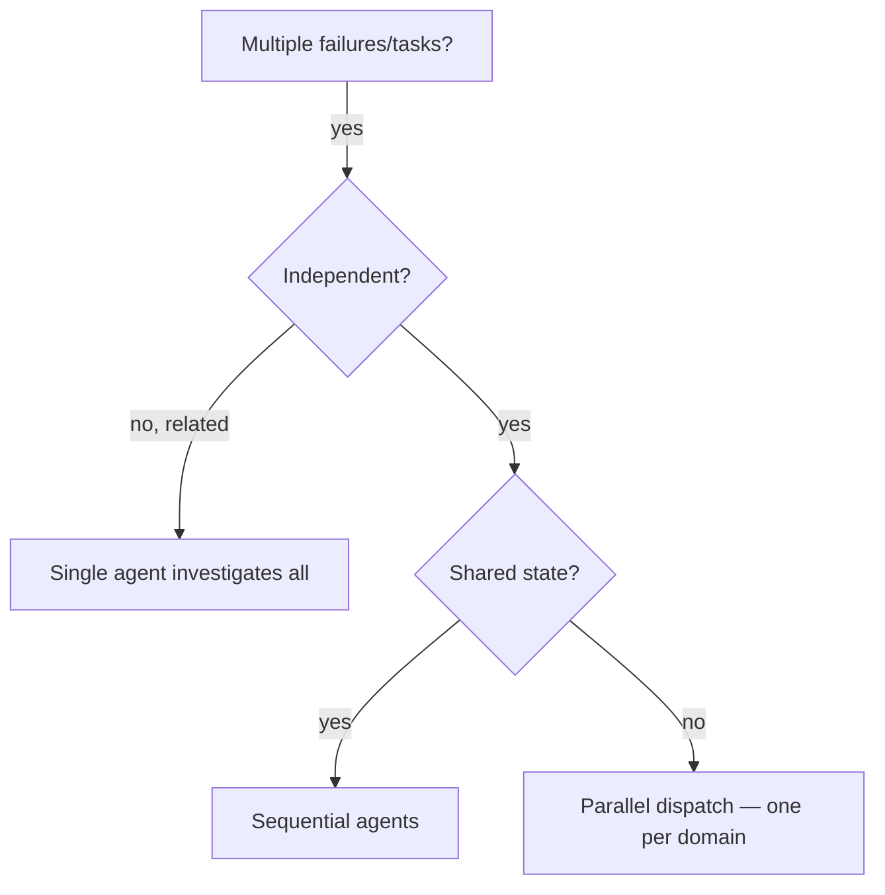

# dev-parallel

Delegate independent problems to subagents with **isolated context**, running concurrently. Each agent
gets exactly the context it needs — never your session history — which also preserves your context for
coordination. Adapted from superpowers `dispatching-parallel-agents` (Mermaid, not Graphviz).

**Core principle:** one agent per independent problem domain; let them run in parallel.

## When

**Use when:** 3+ test files failing with different root causes · multiple subsystems broken
independently · each problem understandable without the others · no shared state.
**Don't:** failures are related (fixing one may fix others) · you need full-system context · agents
would edit the same files.

## Pattern

1. **Group by domain** — what's broken, independently (abort logic ≠ batch completion ≠ race condition).
2. **Write focused tasks** — each agent: specific scope (one file/subsystem) · clear goal · constraints
   (e.g. "don't touch production code") · required output (summary of root cause + changes).
3. **Dispatch concurrently** — one `Task(...)` per domain in a single batch.
4. **Integrate** — read each summary · check for file conflicts · run the full suite · spot-check
   (agents make systematic errors).

## Prompt structure

Focused (one domain) · self-contained (paste the errors/test names, not "the race condition") ·
explicit output. Constrain scope so an agent doesn't refactor everything.

## Common mistakes

❌ "Fix all the tests" (too broad) → ✅ "Fix `agent-tool-abort.test.ts`" · ❌ no error context →
✅ paste failures · ❌ no constraints → ✅ "tests only" · ❌ "fix it" → ✅ "return root cause + changes".
