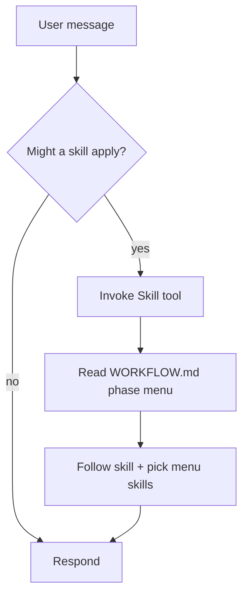

<SUBAGENT-STOP>
If you were dispatched as a subagent to execute a specific task, skip this skill.
</SUBAGENT-STOP>

## Instruction priority

1. **User's explicit instructions** — highest
2. **`.claude/rules/`** — always-on guardrails
3. **Skills** (this kit) — override default behavior where they apply
4. **`AGENTS.md`** and project docs — lowest of these four

## The rule

**Invoke relevant skills BEFORE acting.** If a skill might apply (even ~1% chance), use the Skill tool to load it. Skills are independent — no skill chains into another; sequencing lives in `docs/workflows/WORKFLOW.md`.

## How to access skills

**Claude Code:** Use the `Skill` tool. Never use Read on skill files in `skills/`.

## Workflow

1. Read **`docs/workflows/WORKFLOW.md`** — YAML frontmatter has phases, gates, `suggested_skills`, and `variants`.
2. Pick **0..N skills** from the current phase menu for this change.
3. Use **`workflow-update`** to change the workflow (single edit path).
4. New repo? Run **`doc-init`** once (idempotent).

## Skill priority when multiple apply

1. **Process** — `dev-brainstorm`, `dev-debug`, `dev-plan`
2. **Implementation** — `dev-tdd`, `dev-execute`, domain/`kwb-*` (Phase 3+)
3. **Review** — `review-code`, `review-simplify`
4. **Finish** — `dev-verify`, `dev-commit`

"Let's build X" → check `dev-brainstorm` first (unless `trivial` variant).
"Fix this bug" → `dev-debug` first (often `fix` variant).

## Luna Agent Kit vs native `/workflows`

| Situation | Use |
|-----------|-----|
| Daily gated feature work, user approval between phases | **Luna Agent Kit** |
| 100+ file sweeps, mass migrations, many parallel agents | **Native `/workflows`** |
| Decision memory, plan↔commit tracing, local hooks | **Luna Agent Kit** |

Complementary, not competing.

## Red flags (rationalizations)

| Thought | Reality |
|---------|---------|
| "Too simple for a skill" | Simple tasks use `trivial` variant; still check skills |
| "I'll explore the codebase first" | Use `gitnexus-exploring` or skills that say how to explore |
| "I remember this skill" | Skills evolve — invoke current version |
| "One quick thing first" | Check skills BEFORE doing anything |

## Rigid vs flexible skills

**Rigid** (`dev-tdd`, `dev-debug`, `dev-verify`): follow exactly.

**Flexible** (`kwb-*`, patterns): adapt principles to context. The skill says which.
