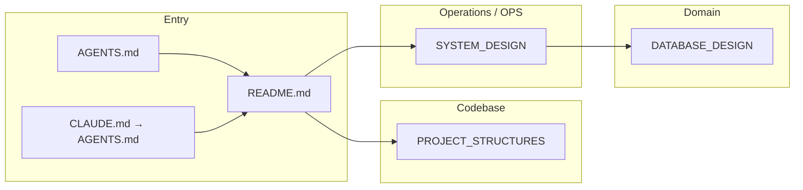

# {Project Name} — docs index

> **Role:** project doc catalog · **Entry:** [`AGENTS.md`](../AGENTS.md) (`CLAUDE.md` → symlink)

## Doc map

Each file owns **one concern**. Do not copy content across files — link instead.

<!-- Replace nodes above with your project's actual docs. Add/remove subgraphs as needed. -->

## Catalog

| File | Role | Read when | Agent keywords |
|------|------|-----------|----------------|
<!-- Add rows following this pattern:
| [`SYSTEM_DESIGN.md`](SYSTEM_DESIGN.md) | **Architecture** — services, data flow, auth | Changing architecture; reviewing infra | docker, nginx, auth, services |
| [`DATABASE_DESIGN.md`](DATABASE_DESIGN.md) | **Schema** — tables, columns, JSONB contracts | Changing DB schema or migrations | schema, migrations, JSONB |
| [`PROJECT_STRUCTURES.md`](PROJECT_STRUCTURES.md) | **File map** — dirs, key paths | Locating files; adding a module | src/, modules/, lib/ |
-->

### Ownership rules (no duplication)

| Topic | Canonical doc | Never duplicate in |
|-------|---------------|-------------------|
<!-- Add rows following this pattern:
| Directory layout & paths | `PROJECT_STRUCTURES.md` | `SYSTEM_DESIGN.md` |
| Service architecture & data flow | `SYSTEM_DESIGN.md` | `PROJECT_STRUCTURES.md` |
| Schema & migrations | `DATABASE_DESIGN.md` | `SYSTEM_DESIGN.md` |
| Commands & env vars | `AGENTS.md` | any `docs/*.md` |
-->

## Read order

1. [`PROJECT_STRUCTURES.md`](PROJECT_STRUCTURES.md) — where code lives
2. [`SYSTEM_DESIGN.md`](SYSTEM_DESIGN.md) — architecture overview
3. Task-specific doc (database → `DATABASE_DESIGN.md`; API → `docs/api/`)
4. GitNexus for callers/callees/impact — never grep for call graphs

## Folders

- **`specs/`** — brainstorming design specs (created by `dev-brainstorm`). Index: [`specs/`](specs/).
- **`plans/`** — plan files (created by `dev-plan`). Registry: [`PLANS.md`](PLANS.md).
- **`_archive/`** — superseded docs. Do not link from living docs.
